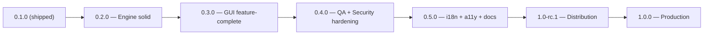
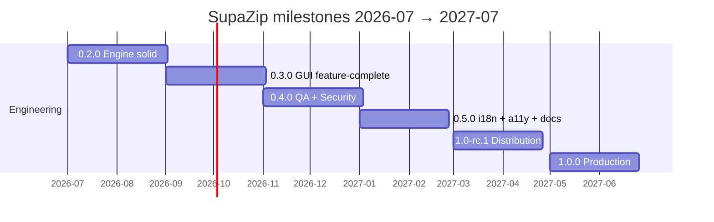

# SupaZip Roadmap (2026-07 → 2027-07)

This roadmap is the single source of truth for SupaZip's 12-month plan from
release `0.2.0` (Engine solid) through `1.0.0` (Production). For complementary
context see [`README.md`](README.md) (project pitch and quick start),
[`CHANGELOG.md`](CHANGELOG.md) (shipped history) and
[`DESIGN.md`](DESIGN.md) (architectural decisions and crate boundaries).

Tracks A–E run in parallel; milestones act as freeze points for the
corresponding track and provide a hard stop to feature creep. When in doubt
about what to ship, the milestone criteria below are authoritative.

## Vision

Production-ready cross-platform archiver written in Rust, exposing three
front-ends (CLI, GUI, library), hardened through fuzzing and property-based
testing, localised for at least three languages, and shipped as signed
binaries on at least four platforms with first-class package manager support.

## Success metrics for 1.0

- 95% test coverage of `supazip-core` (measured by `cargo llvm-cov`).
- 0 clippy warnings, 0 outstanding `RUSTSEC` advisories (rolling 90 days).
- 3 or more localisations shipped (en, ru, +1).
- Binary packages published for 4 or more platforms
  (windows-x64, linux-x64, macos-x64, macos-arm64).
- Published on crates.io with strict semver compliance and a release note
  attached to every GitHub Release.

## Architecture diagram

Tracks execute in parallel; each milestone freezes one track to prevent scope
drift.

## Milestone timeline (Gantt)

## Track A: Engine / core features

| Milestone | Contents | Files |
|---|---|---|
| 0.2.0 | TAR, TAR.GZ and TAR.XZ backends; streaming API that does not require a `Box<dyn Read>` buffer; `Limits::max_compression_ratio` to guard against zip-bombs; solid-archive API for 7z | `supazip-core/src/formats/tar.rs`, `supazip-core/src/formats/tar_gz.rs`, `supazip-core/src/formats/tar_xz.rs`, `supazip-core/src/traits.rs`, `supazip-core/src/error.rs` |
| 0.2.0 | `brotli` and `zstd` compression methods for ZIP (through `zip::CompressionMethod`) | `supazip-core/src/formats/zip.rs` |
| 0.5.0 | Optional `async` trait for backends (via `async-trait` or native AFIT) | `supazip-core/src/traits.rs` |

## Track B: GUI features

| Milestone | Contents | Files |
|---|---|---|
| 0.3.0 | Drag-and-drop onto the main window (via `egui::DropTarget` or `rfd`) | `supazip-gui/src/main.rs`, `supazip-gui/src/lib.rs` |
| 0.3.0 | Context menu on archive entries (extract here / extract to… / test entry) | `supazip-gui/src/` |
| 0.3.0 | Progress dialog with cancel button and virtualised entry list | `supazip-gui/src/views/` |
| 0.3.0 | Recent files menu (persisted under `dirs::data_local_dir` as JSON) | `supazip-gui/src/recent.rs` |
| 0.3.0 | Modal password dialog with show/hide toggle | `supazip-gui/src/dialogs/` |
| 0.5.0 | Multi-window support (settings window alongside the main window) | `supazip-gui/src/windows/` |
| 0.5.0 | Settings persistence (theme override, language, max archive size) | `supazip-gui/src/settings.rs` |
| 0.5.0 | Light theme (only if 0.5 budget allows; otherwise deferred to 1.1) | `assets/themes/light.toml` |

## Track C: QA + Security hardening

| Milestone | Contents | Files |
|---|---|---|
| 0.2.0 | `cargo-fuzz` harnesses covering `list`, `extract` and `create` for every backend | `supazip-core/fuzz/fuzz_targets/*.rs` |
| 0.3.0 | Property-based tests with `proptest` for round-trips and invariants | `supazip-core/tests/proptests/*.rs` |
| 0.3.0 | `criterion` benchmarks for list/extract/create, with a stored baseline and trend graphs | `supazip-core/benches/*.rs` |
| 0.4.0 | `cargo-audit` running in CI on a daily cron schedule | `.github/workflows/audit.yml` |
| 0.4.0 | `cargo-deny` enforcing advisories, bans, licences and sources | `deny.toml`, `.github/workflows/ci.yml` |
| 0.4.0 | MSRV matrix in CI (stable + 1.92) | `.github/workflows/ci.yml` |
| 0.4.0 | OS matrix: `windows-latest`, `ubuntu-latest`, `macos-latest`, `macos-14` (arm64) | `.github/workflows/ci.yml` |
| 0.4.0 | `cargo llvm-cov` with a coverage badge in `README.md`, enforced threshold of 80% | `.github/workflows/coverage.yml` |
| 0.4.0 | Reproducible builds (pinned `SOURCE_DATE_EPOCH`, sorted zip metadata) | `scripts/build-reproducible.sh` |

## Track D: i18n + a11y + docs

| Milestone | Contents | Files |
|---|---|---|
| 0.2.0 | Localise every user-facing string (grow the key set from ~47 to ~80: add GUI dialogs and error messages) | `assets/i18n/en.toml`, `assets/i18n/ru.toml` |
| 0.2.0 | Correct plural forms via ICU (`icu_pluralrules` or `fluent`) | `assets/i18n/*.toml` |
| 0.5.0 | Third localisation (de or zh) — proof that the pipeline handles more than two locales | `assets/i18n/de.toml` |
| 0.5.0 | WCAG 2.1 AA audit of every screen (contrast, focus order, keyboard navigation) | `docs/a11y-audit.md` |
| 0.5.0 | Screen reader smoke test recipes (NVDA / VoiceOver instructions) | `docs/a11y-testing.md` |
| 0.5.0 | `mdbook` documentation: user guide, developer guide, security model | `docs/book/src/*.md`, `book.toml` |
| 0.5.0 | `man` pages for the CLI, generated from the clap definition | `supazip-cli/man/*` |
| 0.5.0 | Optional tutorial videos (only if budget remains) | `docs/videos/` |

## Track E: Distribution / Packaging

| Milestone | Contents | Files |
|---|---|---|
| 0.2.0 | Publish `supazip-core` and `supazip-cli` on crates.io (names reserved in advance) | `Cargo.toml` metadata |
| 0.3.0 | GitHub Releases workflow producing signed checksums (`minisign` or `cosign`) | `.github/workflows/release.yml` |
| 0.5.0 | Homebrew formula merged into `homebrew-core` (PR-based) | external repository |
| 0.5.0 | AUR package `supazip` | `PKGBUILD` |
| 0.5.0 | winget manifest (authored via `wingetcreate`) | `manifests/...` |
| 0.5.0 | scoop bucket | external repository |
| 1.0-rc.1 | Nix flake and overlay | `flake.nix` |
| 1.0-rc.1 | Distroless Docker image | `Dockerfile` |
| 1.0-rc.1 | `.deb` and `.rpm` packages (via `cargo-deb` and `cargo-rpm`) | `supazip-cli/deb/`, `supazip-cli/rpm/` |
| 1.0-rc.1 | CycloneDX SBOM attached to release artefacts | `.github/workflows/release.yml` |
| 1.0-rc.1 | Reproducible-build verification step in the release pipeline | `.github/workflows/release.yml` |

## CLI (treated as a separate work stream in 0.4)

| Contents | Files |
|---|---|
| Shell completions for bash, zsh, fish, PowerShell and Elvish, generated by `clap_complete` | `supazip-cli/completions/*` |
| `--output json\|yaml\|text` for `list` and `test` subcommands | `supazip-cli/src/output.rs` |
| `--quiet`, `--no-progress`, `--verbose` flags | `supazip-cli/src/main.rs` |
| `update` subcommand (via `self_update` or `cargo-update`) | `supazip-cli/src/cmd_update.rs` |
| `verify` subcommand (CRC + signature) | `supazip-cli/src/cmd_verify.rs` |

## Release criteria per version

### 0.2.0

- [ ] All four backends shipped: zip, 7z, tar, tar.gz
- [ ] Path-traversal protection covered by property-based tests
- [ ] `supazip-core` and `supazip-cli` published on crates.io
- [ ] `CHANGELOG.md` updated and tag `v0.2.0` pushed
- [ ] CI green on windows, ubuntu and macos

### 0.3.0

- [ ] GUI: drag-and-drop, context menu and progress dialog
- [ ] Benchmark baseline recorded in CI artefacts
- [ ] Test coverage ≥ 60%

### 0.4.0

- [ ] Fuzzing campaign reports zero regressions over a 24-hour run
- [ ] `cargo-audit` and `cargo-deny` both green
- [ ] Test coverage ≥ 80%
- [ ] CLI: shell completions and JSON output

### 0.5.0

- [ ] Three localisations shipped and a WCAG 2.1 AA audit completed
- [ ] `mdbook` documentation published to GitHub Pages
- [ ] GUI feature-complete against the 0.3.0 + 0.5.0 backlog

### 1.0-rc.1

- [ ] Packages available on Homebrew, AUR, winget, scoop and Nix
- [ ] `.deb`, `.rpm` and Docker image published
- [ ] SBOM and signed checksums attached to the release
- [ ] Tag `1.0-rc-1` pushed

### 1.0.0

- [ ] All 1.0-rc.1 criteria satisfied plus zero P0/P1 bugs for 7 consecutive days
- [ ] `SECURITY.md` with a published disclosure policy
- [ ] Announcement post on the project blog and the Rust user forum

## Out of scope for 1.0

- RAR support — the format is proprietary and would require `unar-bindings`; deferred to 1.1.
- Cloud sync or archive sharing.
- In-place archive editor (mutating individual entries).
- Mobile targets (iOS / Android).
- Plugin system v1 (only reconsidered after 1.0 if real demand surfaces).

## Decisions log

The five open questions that gated work on 0.2.0 were resolved on 2026-06-06
and the answers are recorded in `memory-bank/decisionLog.md`. The summary:

1. **Async-trait for backends** — **deferred past 1.0**. Backends stay synchronous
   for 0.2 → 1.0; the question is re-opened only if real demand (network
   archives, very large streaming inputs) surfaces. Native AFIT is the
   preferred path when it lands.
2. **Light theme** — **deferred to 1.1**. The 1.0 design system stays dark-only
   as in `DESIGN.md`; light theme work begins after the 1.0 release based on
   user feedback.
3. **Tar backend stack** — **pure-Rust**: `tar` + `flate2` + `xz` (all
   MIT/Apache-2.0, no C dependency on Windows). This keeps the CI matrix
   simple and the binary self-contained.
4. **Third localisation** — **de** (German). It exercises a two-form plural
   rule similar to Russian, validates the i18n pipeline at three locales, and
   is high-value for the EU open-source audience.
5. **Self-update in CLI** — **deferred to 1.1**. 1.0 ships without
   `supazip update`; users update through their package manager
   (Homebrew, winget, scoop, apt, AUR). This removes the only self-modifying
   attack surface in the CLI binary.

These decisions are reflected in `docs/milestones/m0.2.0-engine-solid.md` and
in the dependency list of the 0.2.0 release-criteria checklist above.

## Update process

`ROADMAP.md` is reviewed at the end of every milestone: a retrospective is
performed and the next milestone is planned. Decisions to move a feature
between milestones are recorded in `memory-bank/decisionLog.md`. When
deadlines and scope conflict, the rule is **feature freeze, not date freeze**:
we cut items from the milestone rather than slipping the release date.

## Issue workflow

Every milestone task is filed through the dedicated issue template at
`.github/ISSUE_TEMPLATE/milestone-task.yml`. The template captures:

- **Milestone** — dropdown with `0.2.0`, `0.3.0`, `0.4.0`, `0.5.0`, `1.0-rc.1`, `1.0.0`.
- **Track** — dropdown with `A` (Engine), `B` (GUI), `C` (QA + Security), `D` (i18n + a11y + docs), `E` (Distribution).
- **Effort** — size with `S`, `M`, `L`.
- **Ready when** — checklist describing the acceptance conditions that must
  be true before the issue can move from `In Progress` to `Ready for Review`.
