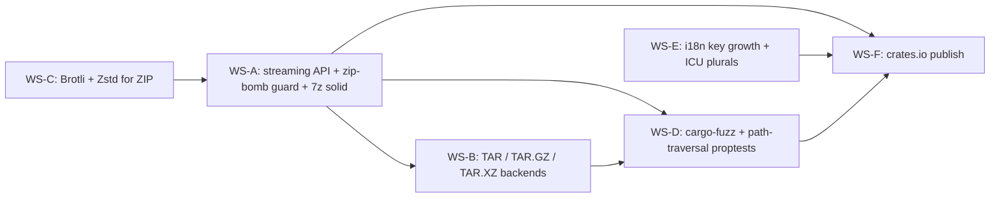

# Milestone 0.2.0 — Engine solid

| Field      | Value                                                                                                                            |
|------------|----------------------------------------------------------------------------------------------------------------------------------|
| Version    | `0.2.0`                                                                                                                          |
| Codename   | Engine solid                                                                                                                     |
| Window     | 2026-07-01 → 2026-08-31 (9 weeks)                                                                                                |
| Owner      | _TBD_ (assign in planning meeting; see `AGENTS.md` for role selection)                                                            |
| Status     | `draft`                                                                                                                          |
| Parent     | `ROADMAP.md` → Track A, Track C, Track D, Track E                                                                               |
| Successor  | `0.3.0 — GUI feature-complete` (2026-09-01)                                                                                      |

## Goals

1. **Four usable backends out of the box.** A user can `list`, `extract`, `create`, and `test` ZIP, 7z, plain TAR and gzipped TAR archives from the CLI with identical ergonomics; the GUI exposes the same set in the Open dialog filter.
2. **Streaming reader without the `Box<dyn Read>` heap allocation.** The `ArchiveFormat` trait accepts any `R: Read` and `W: Write + Seek` through generics, removing the current `Box<dyn Read>` / `Box<dyn WriteSeek>` indirection documented in `supazip-core/src/traits.rs` while keeping the `&dyn ArchiveFormat` registry in place.
3. **Resource limits defeat zip-bombs before they touch memory.** A new `Limits::max_compression_ratio` field caps the ratio between compressed and uncompressed bytes per entry; entries that exceed it are refused with a dedicated `ArchiverError` variant.
4. **7z solid-archive API is exposed and tested.** `SevenZBackend` ships a path that writes solid 7z archives (single LZMA2 stream) and a path that writes non-solid archives (current behaviour), selectable through `CreateOptions`.
5. **ZIP speaks Brotli and Zstandard in addition to the default `Deflated` / `Bzip2` / `Store` methods.** `zip::CompressionMethod` is extended with feature-gated `Brotli` and `Zstd` variants behind Cargo features so existing consumers do not pay the binary-size cost.
6. **All user-facing strings are localised, including plural forms.** The key set grows from 47 to ~80; both `en` and `ru` ship complete, and the GUI / CLI use ICU-based plural rules (e.g. one file vs. `%d files`).
7. **Every backend is exercised by `cargo-fuzz`.** `list`, `extract`, and `create` each have a fuzz harness under `supazip-core/fuzz/fuzz_targets/`; a CI smoke job runs each harness for 60 s on every push.

## Non-goals

- **No async `ArchiveFormat` trait.** The roadmap defers async backends to `0.5.0`. 0.2.0 ships a synchronous API only; no `async-trait`, no AFIT, no tokio streams.
- **No GUI changes beyond text reloads.** The 0.3.0 milestone owns drag-and-drop, context menu, progress dialog, recent files, and password dialog. 0.2.0 only updates existing GUI strings.
- **No new package manager manifests.** AUR, winget, scoop, Homebrew, Nix, .deb, .rpm, and the distroless Docker image are all scheduled for `0.5.0` and `1.0-rc.1`. The only distribution action in 0.2.0 is the `crates.io` publish.
- **No `update` / `verify` CLI subcommands.** These ship in `0.4.0`; 0.2.0 keeps the four subcommands `list`, `extract`, `create`, `test`.
- **No MSRV matrix, no `cargo-deny`, no `cargo-audit`, no `cargo llvm-cov` badge.** Those are 0.4.0 deliverables; 0.2.0 only needs the existing GitHub Actions workflow to remain green on the OS matrix defined in 0.1.0.
- **No reproducible builds, no SBOM.** Both are 1.0-rc.1.
- **No third localisation.** The 0.2.0 deliverable is a complete bilingual `en` + `ru`; adding `de` / `fr` / `zh` / `ja` is a 0.5.0 proof that the pipeline handles > 2 locales.

## Workstreams

### WS-A — Engine: streaming API + zip-bomb guard + 7z solid

**Owner:** _TBD_ (Engine track)
**Estimated effort:** L

Tasks:

1. Replace `Box<dyn Read>` and `Box<dyn WriteSeek>` parameters in `ArchiveFormat` with generics `R: Read` and `W: Write + Seek`. Update the trait in `supazip-core/src/traits.rs`; add a design note explaining how the `LazyLock<HashMap<&str, &'static dyn ArchiveFormat>>` registry in `supazip-core/src/registry.rs` still type-erases through an internal newtype `ErasedArchive<R, W>`.
2. Add `Limits::max_compression_ratio: u32` (default 100, meaning 100× ratio) to `supazip-core/src/traits.rs`; add `ArchiverError::CompressionRatioExceeded { entry, ratio }` to `supazip-core/src/error.rs`. The ratio is enforced inside each backend between the read counter and the decompressed byte counter.
3. Extend `CreateOptions` (in `supazip-core/src/traits.rs`) with a `solid: bool` field that `SevenZBackend` honours. `solid = true` produces a single LZMA2 stream; `solid = false` is the current per-entry-stream behaviour.
4. Wire the new options through the CLI: `supazip-cli/src/cmd_create.rs` exposes `--solid` for `.7z` and `--max-ratio <N>` for any input. The GUI hides these for 0.2.0.
5. Update `supazip-core/src/backends/zip.rs` and `supazip-core/src/backends/sevenz.rs` to honour the new generic signature; keep a wrapper shim for the existing tests that pass `Box<dyn Read>`.
6. Add a `Read` adaptor `CountingReader<R> { inner: R, read: AtomicU64 }` in `supazip-core/src/io.rs`; both the per-archive and per-entry limits are computed off it.
7. Add unit tests in `supazip-core/tests/limits.rs` covering: archive larger than `max_archive_size`, entry larger than `max_entry_size`, count past `max_entry_count`, ratio past `max_compression_ratio`. Each test must produce a deterministic `ArchiverError`, never a panic.
8. Update the engine surface comment block in `README.md` (separate commit, not part of this milestone PR) to reflect the generic signature; keep `Box<dyn Read>` documented as the registry shim.

Definition of done:

- All four backends compile under the generic signature without `Box<dyn Read>` at the public API boundary.
- `cargo test -p supazip-core` passes; new tests cover each `Limits` field.
- `cargo clippy -p supazip-core --no-deps -- -D warnings` is clean.
- `ArchiverError::CompressionRatioExceeded` is documented in the `thiserror` source.
- A CHANGELOG entry describes the trait change and migration note for downstream `ArchiveFormat` implementors (none yet, but the note must exist).

### WS-B — Engine: TAR / TAR.GZ / TAR.XZ backends

**Owner:** _TBD_ (Engine track)
**Estimated effort:** L

Tasks:

1. Add `tar = "0.4"` to `supazip-core/Cargo.toml`. Verify license (MIT/Apache-2.0).
2. Add `flate2 = "1"` (MIT/Apache-2.0) to `supazip-core/Cargo.toml` for `.tar.gz`.
3. Decide between `xz2 = "0.1"` (MIT/Apache-2.0, requires LZMA C library) and the pure-Rust `xz = "0.1"` (MIT). Capture the decision in `memory-bank/decisionLog.md`. See "Open questions" below.
4. Implement `TarBackend` in `supazip-core/src/formats/tar.rs` — plain uncompressed TAR, uses `tar::Archive::new` over a generic `R: Read`.
5. Implement `TarGzBackend` in `supazip-core/src/formats/tar_gz.rs` — wraps a `flate2::read::GzDecoder` then defers to `TarBackend`-style logic.
6. Implement `TarXzBackend` in `supazip-core/src/formats/tar_xz.rs` — wraps an xz decoder, then defers to the same logic. Centralise the TAR-walking helper in a private `tar_walk<R: Read>(reader, dest_dir, entries, progress, limits)` function shared by all three files.
7. Register all three backends in `supazip-core/src/registry.rs` with extensions `.tar`, `.tar.gz`, `.tgz`, `.tar.xz`, `.txz`.
8. Add round-trip integration tests in `supazip-core/tests/tar_roundtrip.rs` covering: create-then-list, create-then-extract, path-traversal payload (`../../etc/passwd`) must be rejected.

Definition of done:

- `cargo run -p supazip-cli -- list foo.tar.gz` lists entries; `extract`, `create`, `test` all work for the three new formats.
- Path-traversal property test (from WS-D) covers the new backends.
- README quickstart shows one example per format.
- CHANGELOG entry lists new supported formats.

### WS-C — Engine: Brotli and Zstandard compression for ZIP

**Owner:** _TBD_ (Engine track)
**Estimated effort:** M

Tasks:

1. Add `brotli = "7"` (BSD-3-Clause) to `supazip-core/Cargo.toml` behind the feature `brotli`.
2. Add `zstd = "0.13"` (MIT) to `supazip-core/Cargo.toml` behind the feature `zstd`. Verify the resolved version through `cargo update -p zstd --dry-run` before pinning.
3. Add the `brotli` and `zstd` features to `supazip-core/Cargo.toml` and re-export the matching constants from `supazip-core/src/formats/zip.rs` as `pub const COMPRESSION_BROTLI: u16` and `pub const COMPRESSION_ZSTD: u16`. The numeric values are the ones the upstream `zip` crate uses for `CompressionMethod`.
4. Map `CreateOptions::compression` to the new methods when the feature is enabled; fall back to `Stored` or `Deflated` when it is not.
5. Add a CLI flag `--compression brotli|zstd|deflated|bzip2|store` in `supazip-cli/src/cmd_create.rs`; reject unknown values with a `clap` value-validator that lists the valid set.
6. Add tests in `supazip-core/tests/zip_compression.rs` that create a small archive under each method and assert the central-directory header reports the expected method id.
7. Update the README tech-stack table to mention the new optional features.

Definition of done:

- `cargo build -p supazip-core --features brotli,zstd` succeeds on the three target OSes; default build (no features) still works.
- `cargo test -p supazip-core --features brotli,zstd` passes.
- A round-trip test confirms the archive written with Brotli can be read back through the same backend.
- A CHANGELOG entry records the new compression methods.

### WS-D — QA: `cargo-fuzz` harnesses + path-traversal property tests

**Owner:** _TBD_ (QA track)
**Estimated effort:** M

Tasks:

1. Add `cargo-fuzz` to the repository: create `supazip-core/fuzz/Cargo.toml` and `supazip-core/fuzz/fuzz_targets/`. Install instructions go in `README.md` under a new "Fuzzing" section.
2. Add the dependency `libfuzzer-sys = "0.4"` (Apache-2.0) inside `supazip-core/fuzz/Cargo.toml`.
3. Write `fuzz_targets/zip_list.rs`, `fuzz_targets/zip_extract.rs`, `fuzz_targets/zip_create.rs`, then the matching triples for `sevenz`, `tar`, `tar_gz`, `tar_xz` (twelve harnesses total). Each harness feeds a `&[u8]` corpus to the backend and asserts it returns `Ok` or a known `ArchiverError` variant; no `unwrap`, no panic.
4. Wire a smoke job in `.github/workflows/ci.yml` (matrix `windows-latest`, `ubuntu-latest`, `macos-latest`) that runs `cargo fuzz run <target> -- -max_total_time=60`. The job is `continue-on-error: true` for 0.2.0 (smoke only); promotion to a hard gate happens in 0.4.0.
5. Add `proptest = "1"` to `[dev-dependencies]` of `supazip-core/Cargo.toml` (MIT/Apache-2.0).
6. Write `supazip-core/tests/proptests/path_traversal.rs` that generates random relative paths containing `..` components and confirms every backend rejects them with `ArchiverError::PathTraversal` (new variant; add to `error.rs`).
7. Add `ArchiverError::PathTraversal { entry: String, reason: &'static str }` to `supazip-core/src/error.rs`; migrate the existing ad-hoc checks in `zip.rs` and `sevenz.rs` to emit this variant.
8. Document the fuzzing workflow in `docs/fuzzing.md` (new file), with a "How to reproduce a finding" runbook.

Definition of done:

- All twelve fuzz harnesses build and run for 60 s in CI without panic on `ubuntu-latest`.
- `cargo test -p supazip-core --test path_traversal` runs 256 cases per backend and passes.
- The new `ArchiverError::PathTraversal` variant is documented and used by both old backends and the new TAR backends.
- `docs/fuzzing.md` is linked from `README.md`.

### WS-E — i18n: key set growth + ICU plurals

**Owner:** _TBD_ (i18n track)
**Estimated effort:** M

Tasks:

1. Audit every user-facing string in `supazip-gui/src/` and `supazip-cli/src/`. Produce a list of new keys (target: grow from 47 to ~80). New keys cover: error messages emitted by the new TAR backends, the new `--compression` flag's help text, the new `--solid` and `--max-ratio` flags, and the new `ArchiverError` variants.
2. Update `assets/i18n/en.toml` and `assets/i18n/ru.toml` with the new keys; keep alphabetical ordering inside each section. Add a `[plurals]` section to each file with at least one pluralised key, e.g. `entries_processed = { one = "1 entry processed", few = "{n} entries processed", many = "{n} entries processed", other = "{n} entries processed" }` (RU rules; EN can use `one` / `other`).
3. Choose the plural library: `icu_pluralrules` (Unicode-3.0, ~2 MB binary overhead) or `fluent` (Apache-2.0, smaller). See "Open questions" below. Document the choice in `memory-bank/decisionLog.md`.
4. Add a thin i18n facade in `supazip-core/src/i18n.rs` (new file) exposing `t(key, locale, args) -> String` and `t_plural(key, locale, n, args) -> String`. The GUI and CLI both depend on `supazip-core` for translation, so the facade lives there.
5. Wire `supazip-gui/src/main.rs` and `supazip-cli/src/main.rs` to call the facade instead of returning hard-coded English in error paths.
6. Add a CI check that fails if the `en` and `ru` key sets diverge; implement as a small script in `scripts/check-i18n.sh` and `scripts/check-i18n.ps1`, invoked from `.github/workflows/ci.yml`.
7. Update `DESIGN.md` rule "i18n coverage" to reflect the new ~80-key count.

Definition of done:

- `en.toml` and `ru.toml` contain the same set of keys; `scripts/check-i18n.sh` exits 0.
- `cargo test -p supazip-core` includes a test that calls `t_plural("entries_processed", "ru", 3, ...)` and asserts the result contains `3`.
- A CHANGELOG entry lists the new keys and the plural support.

### WS-F — Distribution: crates.io publish

**Owner:** _TBD_ (Distribution track)
**Estimated effort:** S

Tasks:

1. Confirm crate names `supazip-core` and `supazip-cli` are reservable on `crates.io`; if reserved by another party, raise the conflict in the planning meeting before 2026-07-01.
2. Fill in `[package]` metadata in `supazip/supazip-core/Cargo.toml` and `supazip/supazip-cli/Cargo.toml`: `description`, `license = "MIT OR Apache-2.0"`, `repository`, `homepage`, `documentation`, `keywords`, `categories`. The categories should be `compression` and `filesystem`.
3. Add `exclude = ["/.github", "/.cursor", "/scripts"]` to keep the published tarball small.
4. Add `[badges]` sections pointing at the GitHub Actions workflow and the (future) `cargo llvm-cov` badge.
5. Author a `README.md` for each crate (or a single `README.md` consumed by both) with a short pitch, install snippet, and link to the workspace README.
6. Run `cargo publish --dry-run -p supazip-core` and `cargo publish --dry-run -p supazip-cli`; resolve any warning before the real publish.
7. Publish `supazip-core` first (CLI depends on it), then `supazip-cli`. The publishing user must be added as a crate owner in the `crates.io` settings.
8. Tag the commit as `v0.2.0` and push the tag; the existing GitHub Actions workflow produces the release draft.
9. Add a CHANGELOG entry "0.2.0 — Engine solid" with the date, the new formats, the new compression methods, the new `Limits` field, and the crates.io links.

Definition of done:

- `cargo install supazip-cli` succeeds on a clean Linux/macOS/Windows machine from crates.io.
- The GitHub Release for `v0.2.0` contains the source tarball that `cargo publish` generated.
- The README on crates.io renders the workspace `README.md` correctly.
- A post-publish sanity check (`cargo install --force supazip-cli && supazip-cli --version`) is recorded in the issue.

## Dependency graph

Reading the graph:

- `WS-A` is the keystone: the generic trait refactor blocks `WS-B` (TAR backends share the new signature) and is required by `WS-D` (fuzz harnesses need the new `PathTraversal` variant wired through the trait).
- `WS-C` is a leaf — Brotli / Zstd are independent of TAR and of the fuzzing infra. It depends on `WS-A` only for the generic writer signature.
- `WS-E` is independent of the engine work. It only depends on the audit of new keys produced by `WS-A` and `WS-B` (the new error messages).
- `WS-F` (the publish) is the final integration point: it cannot start until every other workstream is merged, because the published tarball must contain the final `Cargo.lock` and the new CHANGELOG entry.

## Release checklist

This list mirrors the release criteria in `ROADMAP.md` → "Release criteria per version → 0.2.0", expanded into per-item action checkboxes. Issue / PR numbers are placeholders.

- [ ] All four backends shipped: zip, 7z, tar, tar.gz (TAR.GZ and TAR.XZ are bonus). — `<issue/PR #N>` (WS-A, WS-B)
- [ ] `tar.xz` archive round-trips through the new `TarXzBackend`. — `<issue/PR #N>` (WS-B)
- [ ] Path-traversal protection covered by property-based tests in `supazip-core/tests/proptests/path_traversal.rs`; 256 cases per backend, no failures. — `<issue/PR #N>` (WS-D)
- [ ] `cargo-fuzz` harnesses exist for `list`, `extract`, `create` of every backend (twelve harnesses) and the CI smoke job passes on ubuntu-latest. — `<issue/PR #N>` (WS-D)
- [ ] `supazip-core` published on crates.io at version `0.2.0`. — `<issue/PR #N>` (WS-F)
- [ ] `supazip-cli` published on crates.io at version `0.2.0`. — `<issue/PR #N>` (WS-F)
- [ ] `CHANGELOG.md` updated with a "0.2.0 — Engine solid" section; tag `v0.2.0` pushed; GitHub Release draft published. — `<issue/PR #N>` (WS-F)
- [ ] CI green on `windows-latest`, `ubuntu-latest`, `macos-latest` (matrix inherited from 0.1.0; no MSRV matrix required in 0.2.0). — `<issue/PR #N>`
- [ ] Brotli and Zstandard compression methods for ZIP are available behind the `brotli` and `zstd` Cargo features. — `<issue/PR #N>` (WS-C)
- [ ] `Limits::max_compression_ratio` is in `supazip-core/src/traits.rs` and is honoured by all four backends. — `<issue/PR #N>` (WS-A)
- [ ] `en.toml` and `ru.toml` are in sync; plural forms work for the `entries_processed` key. — `<issue/PR #N>` (WS-E)

## New dependencies

| Name                  | Version | License             | Purpose                                                              | Notes                                                                                                        |
|-----------------------|---------|---------------------|----------------------------------------------------------------------|--------------------------------------------------------------------------------------------------------------|
| `tar`                 | `0.4`   | MIT / Apache-2.0    | TAR backend (read + write)                                           | Pure Rust.                                                                                                   |
| `flate2`              | `1`     | MIT / Apache-2.0    | gzip codec for `.tar.gz`                                              | Optional C backend via `zlib-ng`; default is `miniz_oxide` (Rust).                                           |
| `xz` (preferred)      | `0.1`   | MIT                 | xz codec for `.tar.xz`                                               | Pure Rust, no C dependency. Recommended over `xz2`.                                                          |
| `xz2` (fallback)      | `0.1`   | MIT / Apache-2.0    | xz codec for `.tar.xz` (alternative)                                 | Requires the LZMA C library. On `x86_64-pc-windows-msvc` the build pulls a prebuilt `liblzma` via the `static` feature. Documented in `README.md` build instructions. |
| `brotli`              | `7`     | BSD-3-Clause / MIT  | Brotli compression for ZIP, behind feature `brotli`                  | Compatible with MIT/Apache-2.0.                                                                              |
| `zstd`                | `0.13`  | MIT                 | Zstandard compression for ZIP, behind feature `zstd`                 | Bindings to the C `zstd` library; the `pkg-config` feature is the default.                                   |
| `icu_pluralrules`     | `1`     | Unicode-3.0         | Plural-form selection across locales                                 | Adds ~2 MB to the binary. Optional behind feature `i18n-icu`. Alternative: `fluent` (Apache-2.0).           |
| `fluent`              | `0.16`  | Apache-2.0          | Lighter-weight plural + message formatting                           | Lighter than ICU but uses its own message-format DSL; pick one, not both.                                    |
| `proptest`            | `1`     | MIT / Apache-2.0    | Property-based tests for path-traversal and round-trips              | Dev-dependency only.                                                                                         |
| `cargo-fuzz`          | `0.13`  | Apache-2.0 / MIT    | Fuzz harness runner                                                  | Dev-tool, not a runtime dep.                                                                                 |
| `libfuzzer-sys`       | `0.4`   | Apache-2.0          | FFI to libFuzzer for `cargo-fuzz`                                    | Lives under `supazip-core/fuzz/`.                                                                            |

All licences are compatible with the SupaZip dual-licence (MIT or Apache-2.0). The `icu_pluralrules` Unicode-3.0 licence is a permissive BSD-style licence; it allows redistribution and modification, so it is compatible with MIT/Apache-2.0 downstream usage, but it is not OSI-approved as MIT/Apache-2.0 itself. Note the distinction in `LICENSE-THIRD-PARTY` if it is added.

### xz vs xz2 — build instruction note for `README.md`

> `xz2` requires the LZMA C library. On Linux it is provided by the system package `liblzma-dev` (Debian / Ubuntu) or `xz-devel` (Fedora). On macOS it is provided by `xz` from Homebrew. On Windows MSVC targets the `static` feature pulls a prebuilt `liblzma`; the GNU target requires either vcpkg or a manual download. **Recommendation:** prefer the pure-Rust `xz` crate to avoid the C dependency entirely. If `xz` cannot be used (e.g. for performance reasons on a specific target), add a CI build step that installs the system `xz` development package before running `cargo build`.

## Risk register

| # | Risk                                                                                                      | Likelihood | Impact | Mitigation                                                                                                                                                                                                                          |
|---|-----------------------------------------------------------------------------------------------------------|------------|--------|------------------------------------------------------------------------------------------------------------------------------------------------------------------------------------------------------------------------------------|
| 1 | `xz2` requires the LZMA C library and the Windows MSVC build path is fragile.                            | Medium     | Medium | Prefer the pure-Rust `xz` crate (MIT). If `xz2` is chosen, pin a known-good `xz2` version, add a CI matrix step that runs `cargo build -p supazip-core --features xz2` on all three OSes, and document the system package in `README.md`. |
| 2 | `icu_pluralrules` increases the binary size by ~2 MB and lengthens compile times.                          | High       | Low    | Gate it behind a Cargo feature `i18n-icu`; default to `fluent` (Apache-2.0) which is lighter. The `i18n` feature is on by default; the heavier `i18n-icu` is opt-in.                                                              |
| 3 | `sevenz-rust` solid-archive API is unstable across versions.                                              | Medium     | High   | Pin `sevenz-rust` in `Cargo.lock`; gate the new `solid` option behind the existing `aes256` feature so a non-solid default keeps working. Add a regression test that creates a solid archive and reads it back with the same backend. |
| 4 | Generic `ArchiveFormat` trait breaks the `&dyn ArchiveFormat` registry and downstream consumers.          | Medium     | High   | Keep the `Box<dyn Read>` shim available through an internal newtype in `supazip-core/src/registry.rs`. Update the design note in `traits.rs` and document the migration in `CHANGELOG.md`. Run the 0.1.0 test suite unchanged.    |
| 5 | The new fuzz harnesses find a panic in `tar` / `flate2` / `xz` that the upstream maintainers must fix.    | Medium     | Medium | Run a 24-hour pre-merge fuzz campaign in a fork before tagging `v0.2.0`. File issues upstream with reproducer corpora. If the panic is in our code, fix before release; if upstream, gate the affected format behind a `#[ignore]` test. |
| 6 | `crates.io` names `supazip-core` / `supazip-cli` are already taken.                                       | Low        | High   | Verify availability on day one of the milestone (2026-07-01). If taken, fall back to the `supazip-core-archive` / `supazip-cli-archive` working names discussed in `memory-bank/decisionLog.md` and re-tag.                       |

## Open questions

These five questions are inherited from `ROADMAP.md` → "Open questions". They are not blockers for starting the implementation — the workstream owners can pick a default, record it in `memory-bank/decisionLog.md`, and revisit at the milestone retrospective. The questions are discussed in a separate `AskQuestion` session at the start of the milestone.

1. **Async-trait in 0.5 or never?** Default for 0.2.0: no async. The `ArchiveFormat` trait stays synchronous; tokio integration is left to the GUI's `mpsc` channels and `ChannelProgress`. Reopen in 0.5.0.
2. **Light theme in 0.5 or 1.1?** Default for 0.2.0: dark-only. `DESIGN.md` is unchanged. Reopen at the 0.5.0 design review.
3. **Tar backends via `tar` + `flate2` + `xz2` or pure-Rust?** Default for 0.2.0: pure-Rust stack (`tar` + `flate2` + `xz`). This decision is final for 0.2.0 unless a perf regression is measured. See WS-B task 3.
4. **Third locale — de, fr, zh, ja?** Default for 0.2.0: no third locale. Pick at the 0.5.0 i18n planning meeting; the candidate set is the four listed.
5. **Self-update on or off?** Default for 0.2.0: not included. The `update` subcommand is scheduled for 0.4.0; the security model for self-update is not yet written.

These questions are discussed separately, see `ROADMAP.md` → "Open questions".
