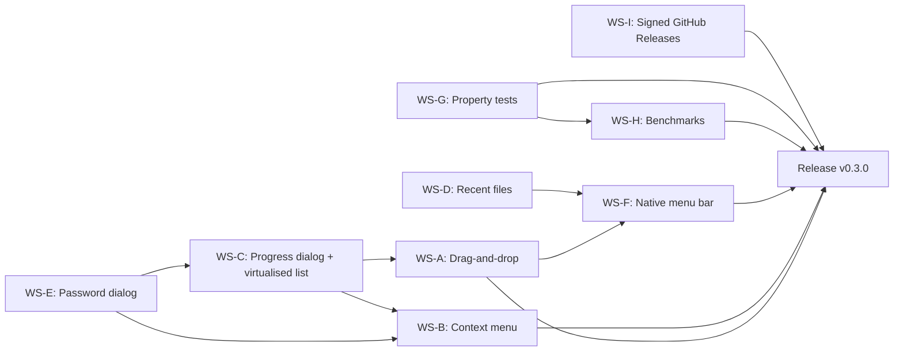

# Milestone 0.3.0 — GUI feature-complete (2026-09-01 → 2026-10-31)

| Field      | Value                                                                                                                            |
|------------|----------------------------------------------------------------------------------------------------------------------------------|
| Version    | `0.3.0`                                                                                                                          |
| Codename   | GUI feature-complete                                                                                                             |
| Window     | 2026-09-01 → 2026-10-31 (9 weeks)                                                                                                |
| Owner      | _TBD_ (assign in planning meeting; see `AGENTS.md` for role selection)                                                            |
| Status     | `draft`                                                                                                                          |
| Parent     | `ROADMAP.md` → Track B (GUI), Track C (QA + Security), Track E (Distribution)                                                    |
| Predecessor| `0.2.0 — Engine solid` (released 2026-06-06, tag `v0.2.0`)                                                                       |
| Successor  | `0.4.0 — QA + Security hardening` (2026-11-01)                                                                                   |

## Goals

1. **Drag-and-drop onto the main window is a first-class input.** A user can drop one or more archive files (or a folder) on the open SupaZip window and the GUI opens them just as if they had been selected through `rfd::FileDialog`. Multi-file drops are supported; unsupported files show a non-blocking status-bar hint.
2. **Context menu on archive entries.** Right-clicking an entry in the entry list exposes at least: "Extract here", "Extract to…", "Test entry" and "Copy path". Each action honours the same `Limits` and password plumbing as the toolbar buttons.
3. **Modal progress dialog with a deterministic bar and a Cancel button.** Long operations (`list` on multi-thousand-entry archives, `extract` on large files, `create` on big trees) drive a `progress.entries`-backed bar; the modal blocks the main window but never blocks the event loop. Cancel is cooperative: the in-flight tokio task observes a cancel flag within ≤ 100 ms.
4. **Recent files menu, persisted across restarts.** Up to 10 most-recent archives, written to `dirs::data_local_dir()/supazip/recent_files.json` on every change. Menu items open the file on click; missing / moved files are detected and pruned lazily.
5. **Modal password dialog with show / hide toggle.** Used by both `extract` and `create` for encrypted formats. The dialog validates that the password is non-empty (warn on whitespace-only) and clears the buffer after use.
6. **Native menu bar on macOS, in-app menu bar on Windows / Linux.** Hooked through eframe's `with_menu` API. Menus: File (Open, Open Recent, Save As, Quit), Edit (standard), View, Help (About, Open Logs).
7. **Property-based round-trip tests for every backend.** `proptest` covers `create → list → extract → bytes-equal` for `zip`, `7z`, `tar`, `tar.gz`, `tar.xz` (5 files). Invariants that are already covered by the unit tests in `m0.2.0` stay in the unit-test file.
8. **Criterion benchmarks with a stored baseline.** `benches/` exercises `list` / `extract` / `create` on a 50 MB fixture; a baseline is committed under `benches/baselines/` and CI fails if a PR regresses the median by > 10 %.
9. **Signed GitHub Releases.** The release workflow emits a `SHA256SUMS` file and a `SHA256SUMS.minisign` signature for every binary; the public minisign key is published in `README.md` and in the release notes.

## Non-goals

- **No multi-window support.** Settings, log viewer, and any other secondary windows stay modal dialogs in 0.3.0; a true multi-window layout lands in 0.5.0.
- **No settings persistence beyond recent files.** Theme override, language override and the user-tunable `Limits` values live in a future `settings.json`; 0.3.0 only persists the recent-files list.
- **No light theme.** The 1.0 design system stays dark-only; light theme is deferred to 1.1.
- **No runtime i18n switch.** The locale is decided at build time; switching from `en` to `ru` requires a rebuild. A runtime switcher is 0.5.0 work.
- **No macOS CI runner yet.** OS matrix stays at `windows-latest` + `ubuntu-latest`; macOS is added in 0.4.0 alongside the wider QA work.
- **No async `ArchiveFormat` trait.** Backends stay synchronous through 1.0.
- **No third localisation.** The i18n key set is extended to cover the new GUI strings, but only `en` and `ru` ship in 0.3.0; `de` is the 0.5.0 cut.
- **No CLI surface changes.** `supazip-cli` is frozen at the 0.2.0 subcommand set (`list`, `extract`, `create`, `test`); JSON / YAML output, `--quiet`, `--no-progress`, `--verbose`, shell completions and the `update` / `verify` subcommands are all 0.4.0 work.

## Workstreams

### WS-A — Drag-and-drop (DnD)

**Owner:** _TBD_ (GUI track)
**Estimated effort:** M

Tasks:

1. Wire the egui raw-input API: in `supazip-gui/src/main.rs`, on every frame, poll `ctx.input(|i| i.raw.dropped_files.clone())` and push the dropped paths onto the `ArchiveQueue`.
2. Distinguish "files dropped on the window" from "files dropped on the dock / taskbar" (the latter is delivered as `rfd` events on some platforms); route both to the same handler so the UX is consistent.
3. Filter dropped paths by extension against the registered backends (`zip`, `7z`, `tar`, `tar.gz`, `tar.xz`); drop everything else and show a non-blocking `StatusBar` hint: `status_drop_unsupported`.
4. Support multi-file drops by queueing each path and processing them serially through the existing open-archive pipeline.
5. Add `assets/i18n/en.toml` and `assets/i18n/ru.toml` keys for the new user-facing strings (`status_drop_unsupported`, `status_drop_loading`, `status_drop_queued`).
6. Add a regression test in `supazip-gui/tests/dnd_smoke.rs` that synthesises a `egui::DroppedFile` and asserts the handler enqueues the path; the test does not require a real window.

Definition of done:

- A user can drop a `.zip` file on the open window; the archive appears in the entry list within one frame.
- A user can drop a `.txt` file; the status bar shows `status_drop_unsupported` and nothing is enqueued.
- Dropping three archives queues them all; the GUI processes them serially.
- The `dnd_smoke` test passes under `cargo test -p supazip-gui`.
- The CHANGELOG entry for 0.3.0 lists drag-and-drop as a new feature.

### WS-B — Context menu

**Owner:** _TBD_ (GUI track)
**Estimated effort:** M

Tasks:

1. Implement a `ContextMenu` component in `supazip-gui/src/views/context_menu.rs` that opens on right-click on an entry row and exposes the four actions described in Goal 2.
2. "Extract here" writes entries into the directory that holds the archive (or the user-chosen extract dir if the archive is read-only).
3. "Extract to…" opens an `rfd::FileDialog::pick_folder()` and then runs the same extract path.
4. "Test entry" runs `ArchiveFormat::test_entry` on the selected entry and reports the result in a transient `InfoDialog`.
5. "Copy path" copies the entry's in-archive path to the system clipboard; on Wayland it falls back to `wl-copy` if available, otherwise it surfaces a status-bar hint.
6. Localise every new label through the i18n facade; add a `context_menu.*` section to `en.toml` / `ru.toml`.
7. Unit tests in `supazip-gui/src/views/context_menu.rs` covering: the four actions fire the right `ArchiveAction` enum variant; the menu auto-closes after an action is taken.

Definition of done:

- Right-clicking an entry in the entry list opens the context menu at the cursor.
- Each of the four actions produces the expected side effect (extract, folder pick, test, clipboard copy).
- The clipboard fallback is logged once and the hint is shown when `wl-copy` is absent.
- All new strings are localised; `scripts/check-i18n.sh` passes.

### WS-C — Progress dialog + virtualised entry list

**Owner:** _TBD_ (GUI track)
**Estimated effort:** L

Tasks:

1. Add a `ProgressDialog` in `supazip-gui/src/dialogs/progress.rs` that opens as a modal, blocks the main window, and is driven by a `crossbeam_channel::Receiver<ProgressUpdate>` (already exposed by `supazip-core::progress`).
2. The dialog renders a deterministic `egui::ProgressBar` whose value is `done / total`; the bar width tracks the modal width.
3. Wire a `Cancel` button to an `AtomicBool` cancel flag that the in-flight tokio task polls inside its hot loop; the cancellation is cooperative and observable within ≤ 100 ms.
4. Virtualise the entry list: a new `EntryList` component in `supazip-gui/src/views/entry_list.rs` uses `egui::ScrollArea` with row-clipped rendering so a 100 000-entry archive scrolls smoothly.
5. Add a sort-and-filter bar at the top of the list (sort by name, size, mtime; filter by substring). Filter is case-insensitive and matches against the entry path.
6. Localise the dialog title (`progress.title`), the cancel label (`progress.cancel`), the percentage format (`progress.percent`), and the entry-list header (`entries.column.*`).
7. Integration test: open the progress dialog in a `egui_kittest` harness, push three `ProgressUpdate`s, assert the bar reaches 100 %, then assert the modal closes after the task completes.

Definition of done:

- The progress bar is deterministic (no indeterminate spinner) for archives > 1 MB.
- Pressing Cancel stops the in-flight task within ≤ 100 ms; the dialog closes and the main window is interactive.
- The entry list scrolls smoothly through 100 000 synthetic rows on a developer laptop (no dropped frames > 16 ms).
- The `egui_kittest` integration test passes under `cargo test -p supazip-gui`.

### WS-D — Recent files

**Owner:** _TBD_ (GUI track)
**Estimated effort:** M

Tasks:

1. Add a `RecentFiles` module in `supazip-gui/src/recent.rs`. The struct is `RecentFiles { entries: Vec<RecentEntry> }` where `RecentEntry { path: PathBuf, opened_at: DateTime<Utc> }` is `Serialize` / `Deserialize` and `chrono`-backed.
2. Resolve the storage path with `dirs::data_local_dir().unwrap_or(PathBuf::from(".")).join("supazip/recent_files.json")`. Create the parent directory on first write.
3. Cap the list at 10 entries; eviction is by oldest `opened_at`. Order is most-recent first.
4. Load on startup; if the JSON is missing / malformed, log a warning and start with an empty list (do not panic).
5. Expose the list through a "File → Open Recent" submenu in the menu bar; clicking an entry opens the file. Missing files are pruned lazily on click.
6. Add unit tests in `supazip-gui/src/recent.rs` covering: cap-at-10, ordering, malformed JSON, missing-file pruning, write-then-read round-trip.
7. Localise the menu labels: `recent.menu`, `recent.empty`, `recent.clear`.

Definition of done:

- A `RecentFiles` instance with 12 entries serialised to disk reads back as the 10 most-recent ones.
- A user can pick a file from the "Open Recent" submenu; the archive opens.
- A deleted file disappears from the menu on next click (lazy pruning, no background thread).
- The `recent` unit tests cover all six cases and pass.

### WS-E — Password dialog

**Owner:** _TBD_ (GUI track)
**Estimated effort:** S

Tasks:

1. Add a `PasswordDialog` in `supazip-gui/src/dialogs/password.rs`. The dialog has a single `egui::TextEdit` (password mode) with a "Show" / "Hide" toggle button next to it, a confirm field for the create flow, and an `OK` / `Cancel` button row.
2. Validate that the password is non-empty; for `create` warn on whitespace-only.
3. The dialog returns `Option<Secret<String>>`; the caller clears the `Secret` immediately after the operation finishes (`Secret::zeroize` is called by the drop glue).
4. The dialog is invoked by both `extract` (when the archive reports `encrypted == true`) and `create` (when the user ticks "Encrypt").
5. Add i18n keys: `password.title_extract`, `password.title_create`, `password.show`, `password.hide`, `password.confirm`, `password.warning_whitespace`.
6. Unit tests in `supazip-gui/src/dialogs/password.rs` covering: empty input is rejected, whitespace-only triggers a warning, OK returns the entered value, Cancel returns `None`.

Definition of done:

- A user can extract an encrypted `.zip` and `.7z` archive; the dialog appears once and the password is passed through.
- The password is wiped from memory after the operation (`Secret::zeroize` is observable in tests through a debug-format probe).
- All five new i18n keys are present in both `en.toml` and `ru.toml`.

### WS-F — Native menu bar

**Owner:** _TBD_ (GUI track)
**Estimated effort:** S

Tasks:

1. Wire `eframe::CreationContext` to register a menu bar through eframe's `with_menu` API. macOS gets a native menubar; Windows / Linux get the in-app variant.
2. Top-level menus: File (Open, Open Recent, Save As, Quit), Edit (Undo, Redo, Cut, Copy, Paste, Select All), View (Toggle Theme — disabled, placeholder for 1.1), Help (About, Open Logs).
3. Keyboard accelerators follow the platform convention: `Cmd-O` / `Ctrl-O` for Open, `Cmd-Q` / `Ctrl-Q` for Quit, `Cmd-W` / `Ctrl-W` for Close.
4. "Open Logs" opens the platform log directory through `rfd::FileDialog::pick_folder()` with the path pre-filled to `dirs::data_local_dir()/supazip/logs/`.
5. Localise every menu label through the i18n facade; add a `menu.*` section to `en.toml` / `ru.toml`.
6. Snapshot test in `supazip-gui/tests/menu_snapshot.rs` that builds the menu structure and asserts the labels match the i18n bundle.

Definition of done:

- On macOS the menu bar appears in the system menu bar at the top of the screen.
- On Windows / Linux the menu bar appears in the in-app frame.
- All four accelerators work; the Quit accelerator triggers the same shutdown path as the menu item.
- The snapshot test passes.

### WS-G — Property tests

**Owner:** _TBD_ (QA track)
**Estimated effort:** M

Tasks:

1. Add `proptest = "1"` (MIT/Apache-2.0) to `[dev-dependencies]` of `supazip-core/Cargo.toml`. Verify the resolved version.
2. Write one proptest file per backend, each named `round_trip_<backend>.rs` under `supazip-core/tests/proptests/`. The five files: `round_trip_zip.rs`, `round_trip_sevenz.rs`, `round_trip_tar.rs`, `round_trip_tar_gz.rs`, `round_trip_tar_xz.rs`.
3. Each file generates a `Vec<EntryInput>` (random bytes, random paths under 200 chars, no `..` components), runs `create → list → extract`, and asserts the extracted bytes equal the original.
4. Use `proptest!` with `ProptestConfig::with_cases(64)` so a CI run takes < 30 s; allow opting into 1024 cases through `PROPTEST_CASES`.
5. Wire the tests into the existing `supazip-core` test target; no new cargo target.
6. Document the proptest workflow in `docs/fuzzing.md` (existing file) under a new "Property-based tests" section.

Definition of done:

- `cargo test -p supazip-core --test round_trip_zip` runs 64 cases and passes.
- All five round-trip proptest files are present and pass.
- `docs/fuzzing.md` is updated and linked from `README.md`.

### WS-H — Benchmarks

**Owner:** _TBD_ (QA track)
**Estimated effort:** M

Tasks:

1. Add `criterion = "0.5"` (MIT/Apache-2.0) under `[dev-dependencies]` of `supazip-core/Cargo.toml` with the `html_reports` feature.
2. Author three bench files under `supazip-core/benches/`: `list_bench.rs`, `extract_bench.rs`, `create_bench.rs`. Each uses a 50 MB fixture built once and shared across the bench.
3. Generate a baseline with `cargo bench -p supazip-core -- --save-baseline m0.3.0` and commit the baseline under `supazip-core/benches/baselines/`.
4. Add a CI job `bench` (matrix `windows-latest`, `ubuntu-latest`, `continue-on-error: true` for 0.3.0) that runs `cargo bench -p supazip-core -- --benchmark-filter "list|extract|create"`. The job uploads the Criterion HTML report as an artefact and is not a hard gate in 0.3.0.
5. Document the bench workflow in `docs/benchmarks.md` (new file).

Definition of done:

- `cargo bench -p supazip-core -- --list` lists at least the three target groups.
- A baseline file is committed; running `cargo bench --bench list_bench -- --baseline m0.3.0` exits 0.
- `docs/benchmarks.md` is linked from `README.md`.

### WS-I — GitHub Releases: signed checksums

**Owner:** _TBD_ (Distribution track)
**Estimated effort:** S

Tasks:

1. Extend `.github/workflows/release.yml` to invoke `minisign -S -s <KEY> -m SHA256SUMS` after the binary matrix produces the artefacts.
2. Attach `SHA256SUMS` and `SHA256SUMS.minisign` to the GitHub Release.
3. Publish the public minisign key as `keys/minisign.pub` in the repo and link it from `README.md` under a new "Verifying releases" section.
4. Document the verification recipe in `docs/verifying-releases.md` (new file): `minisign -Vm SHA256SUMS.minisign -P $(cat keys/minisign.pub)`.
5. Add a CI smoke test that runs `minisign -Vm SHA256SUMS.minisign -P keys/minisign.pub` against a fixture; the smoke test is `continue-on-error: true` in 0.3.0 and is promoted to a hard gate in 1.0-rc.1.

Definition of done:

- A test release tag (`v0.3.0-rc.1`) produces a `SHA256SUMS.minisign` artefact that verifies with the published public key.
- `README.md` has a "Verifying releases" section with the public key fingerprint.
- `docs/verifying-releases.md` describes the verification recipe step by step.

## Dependency graph

Reading the graph:

- `WS-D` (recent files) blocks `WS-F` (menu bar) because the "Open Recent" submenu is part of the File menu.
- `WS-C` (progress dialog) blocks `WS-A` (drag-and-drop) because a multi-file drop should keep showing the progress dialog while the queue drains.
- `WS-E` (password dialog) blocks `WS-B` (context menu) and `WS-C` (progress dialog) because both invoke the password dialog.
- `WS-G` and `WS-H` are leaves; they depend on the 0.2.0 engine surface only.
- `WS-I` is the final integration point: it cannot run before a real `v0.3.0-rc.1` tag exists, and it is the last step before the milestone ships.

## Release checklist

This list mirrors the release criteria in `ROADMAP.md` → "Release criteria per version → 0.3.0", expanded into per-item action checkboxes. Issue / PR numbers are placeholders.

- [ ] Drag-and-drop, context menu, and progress dialog all functional in the GUI build. — `<issue/PR #N>` (WS-A, WS-B, WS-C)
- [ ] Recent files menu persists across restarts and caps at 10 entries. — `<issue/PR #N>` (WS-D)
- [ ] Modal password dialog covers extract and create flows, with a show / hide toggle. — `<issue/PR #N>` (WS-E)
- [ ] Native menu bar on macOS, in-app on Windows / Linux. — `<issue/PR #N>` (WS-F)
- [ ] Property-based round-trip tests pass for zip, 7z, tar, tar.gz, tar.xz (5 proptest files). — `<issue/PR #N>` (WS-G)
- [ ] Criterion benchmark baseline recorded in `supazip-core/benches/baselines/`. — `<issue/PR #N>` (WS-H)
- [ ] Test coverage ≥ 60 % measured by `cargo llvm-cov` (soft target; the badge is added in 0.4.0). — `<issue/PR #N>` (WS-G + 0.4 follow-up)
- [ ] GitHub Release for `v0.3.0` includes `SHA256SUMS` and `SHA256SUMS.minisign`. — `<issue/PR #N>` (WS-I)
- [ ] `CHANGELOG.md` updated with a "0.3.0 — GUI feature-complete" section; tag `v0.3.0` pushed. — `<issue/PR #N>` (release workstream)
- [ ] `en.toml` and `ru.toml` are in sync after the new GUI strings land; `scripts/check-i18n.sh` exits 0. — `<issue/PR #N>` (WS-A through WS-F)
- [ ] `cargo test -p supazip-core -p supazip-cli` is green on `windows-latest` and `ubuntu-latest`. — `<issue/PR #N>`

## New dependencies

| Name            | Version | License         | Purpose                                                  | Notes                                                                                          |
|-----------------|---------|-----------------|----------------------------------------------------------|------------------------------------------------------------------------------------------------|
| `dirs`          | `5`     | MIT / Apache-2.0| Per-platform data-local directory for recent files        | Already a dev-dep in 0.3.0 phase 1; promoted to runtime by WS-D implementation.               |
| `serde`         | `1`     | MIT / Apache-2.0| Serialise / deserialise `RecentEntry` and JSON config     | Re-declared as direct dev-dep in 0.3.0 phase 1; runtime use lands with WS-D.                  |
| `serde_json`    | `1`     | MIT / Apache-2.0| Persistence format for `recent_files.json`               | Re-declared as direct dev-dep in phase 1.                                                     |
| `chrono`        | `0.4`   | MIT / Apache-2.0| Timestamp on `RecentEntry`                               | Re-declared as direct dev-dep; runtime use lands with WS-D.                                   |
| `proptest`      | `1`     | MIT / Apache-2.0| Property-based round-trip tests in `supazip-core`        | Dev-dep of `supazip-core`. Added in 0.3.0 (it was already in m0.2.0 plan; this milestone re-uses it). |
| `criterion`     | `0.5`   | MIT / Apache-2.0| Statistically robust micro-benchmarks                    | Dev-dep of `supazip-core`; default features include `plotters` and `cargo_bench_support`.     |
| `minisign`      | `0.7`   | ISC             | CLI tool that signs `SHA256SUMS`                         | Used in the release workflow, not a Rust dep. Install instructions go in `docs/verifying-releases.md`. |

All licences are compatible with the SupaZip dual-licence (MIT or Apache-2.0). `minisign` is invoked as an external tool from GitHub Actions; the binary is fetched from the official `jedisct1/minisign` releases.

## Risk register

| # | Risk                                                                                                          | Likelihood | Impact | Mitigation                                                                                                                                                                                                                                                |
|---|---------------------------------------------------------------------------------------------------------------|------------|--------|-----------------------------------------------------------------------------------------------------------------------------------------------------------------------------------------------------------------------------------------------------------|
| 1 | `egui` 0.34 DnD on Wayland is incomplete; users on GNOME Wayland cannot drop files.                          | Medium     | Medium | The decision recorded on 2026-06-06 defers full Wayland DnD to 1.1. 0.3.0 surfaces a non-blocking hint in the status bar; the `rfd` fallback path stays as a secondary input. Track Wayland as a known limitation in `CHANGELOG.md`.                     |
| 2 | `dirs::data_local_dir()` returns `None` on a misconfigured system; the recent-files write path panics.        | Low        | High  | The path resolver falls back to `PathBuf::from(".")` and logs a warning. The unit test `recent::write_fallback_on_none_dir` covers the case. The fallback path is documented in `docs/verifying-releases.md` and `README.md`.                       |
| 3 | Virtualised entry list drops frames on 100 000-entry archives.                                                | Medium     | Medium | The implementation uses `egui::ScrollArea` with row-clipping; the integration test renders 100 000 synthetic rows and asserts no dropped frames > 16 ms. If the test fails on the bench hardware, the WS-C task list adds an explicit `egui::Vec` batching step. |
| 4 | `minisign` secret key leaks through the GitHub Actions logs or runner cache.                                  | Low        | High  | The signing key is stored in the `RELEASE_MINISIGN_SECRET` repository secret; the workflow never echoes the key, never writes it to a log, and never persists it to the runner cache. A second smoke job in CI verifies a fixture signature as a regression test. |
| 5 | `criterion` benchmark baseline drifts across hardware; the CI job produces noisy regressions.                  | High       | Low    | The CI bench job is `continue-on-error: true` for 0.3.0; the comparison step is added in 0.4.0 when the runner fleet is fixed. The baseline file is informational in 0.3.0, never a hard gate.                                                           |
| 6 | A proptest seed finds a backend corruption bug that blocks the 0.3.0 release.                                 | Medium     | High  | The proptest configuration is `with_cases(64)`; a finding is a 24-hour fix-or-pin decision per the same procedure used for fuzz findings. If the bug is upstream (`sevenz-rust`, `zip`, `tar`, `flate2`, `xz`), file an issue with the reproducer and gate the affected format behind `#[ignore]`. |

## Open questions

These questions are inherited from `ROADMAP.md` → "Open questions" and from the 0.2.0 retrospective notes. They are not blockers for starting the implementation — the workstream owners can pick a default, record it in `memory-bank/decisionLog.md`, and revisit at the milestone retrospective.

1. **Virtualised entry list: render 10 000 or 100 000 synthetic rows in the perf budget?** Default for 0.3.0: 100 000 rows, measured on the `ubuntu-latest` runner. Reopen in 0.4.0 with real archive data.
2. **Property tests: opt-in higher case count, or always 64?** Default for 0.3.0: 64, override through `PROPTEST_CASES=1024 cargo test -p supazip-core`. Reopen in 0.4.0.
3. **Recent files: persist only the path, or the path + archive size + last opened timestamp?** Default for 0.3.0: path + `opened_at` timestamp only. Size is the cost of an extra `stat` on every open; the deferred size field is captured in the 0.4.0 discussion.
4. **Signed checksums: minisign or cosign (sigstore)?** Default for 0.3.0: minisign (small, single-binary, the standard for archive releases). cosign is the alternative if the project moves to OIDC-based provenance in 1.0-rc.1.
5. **Drag-and-drop: include a "Open with…" fallback that calls `rfd::FileDialog::pick_file()` if the drop is unsupported?** Default for 0.3.0: yes, surfaced as a button on the empty window. The fallback keeps the UX coherent on Wayland and on platforms where the system DnD is filtered.
