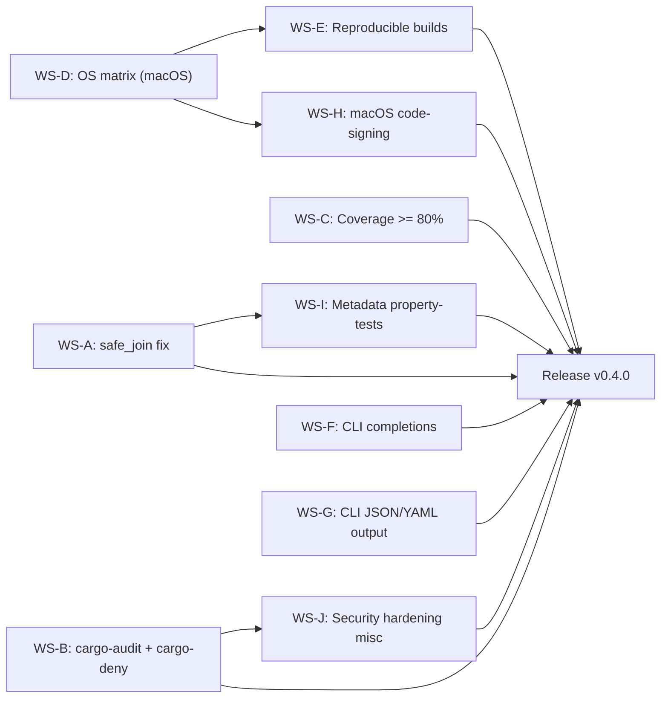

# Milestone 0.4.0 -- QA + Security hardening (2026-11-01 -> 2026-12-31)

| Field      | Value                                                                                                                            |
|------------|----------------------------------------------------------------------------------------------------------------------------------|
| Version    | `0.4.0`                                                                                                                          |
| Codename   | QA + Security hardening                                                                                                          |
| Window     | 2026-11-01 -> 2026-12-31 (9 weeks)                                                                                               |
| Owner      | _TBD_ (assign in planning meeting; see `AGENTS.md` for role selection)                                                           |
| Status     | `draft`                                                                                                                          |
| Parent     | `ROADMAP.md` -> Track C (QA + Security), CLI work stream, Track E (Distribution)                                                 |
| Predecessor| `0.3.0 -- GUI feature-complete` (planned 2026-10-31, tag `v0.3.0`)                                                              |
| Successor  | `0.5.0 -- i18n + a11y + docs` (2027-01-01)                                                                                      |

## Goals

1. **Fuzzing campaign reports zero regressions over a 24-hour run.** All existing `cargo-fuzz` harnesses (list/extract/create x 5 backends) are run nightly on the expanded OS matrix; a 24h continuous run on `ubuntu-latest` produces zero crashes, timeouts, or OOM kills.
2. **`cargo-audit` and `cargo-deny` are green in CI.** Every PR and the daily cron job run `cargo audit` and `cargo deny check`; advisory, licence, ban and source violations are hard gates.
3. **Test coverage >= 80 % measured by `cargo llvm-cov`.** A `coverage.yml` workflow generates an lcov report, uploads it as an artefact, and enforces the 80 % threshold as a CI gate. A coverage badge is rendered in `README.md`.
4. **CLI shell completions for five shells.** `supazip completions <SHELL>` generates completion scripts for bash, zsh, fish, PowerShell and Elvish via `clap_complete`. The scripts are also bundled in the release artefacts.
5. **CLI structured output: `--output json|yaml|text`.** The `list` and `test` subcommands accept `--output` to emit machine-parseable JSON or YAML alongside the default human-readable text. This enables scripting and CI integration.
6. **macOS runners in the CI OS matrix.** The CI matrix expands to `windows-latest`, `ubuntu-latest`, `macos-latest` (x86_64) and `macos-14` (arm64). All tests, clippy and doc checks pass on all four runners.
7. **Reproducible builds verified by CI.** A `scripts/build-reproducible.sh` script pins `SOURCE_DATE_EPOCH`, sorts zip metadata and produces a bit-identical binary given the same toolchain and source tree. A CI job verifies reproducibility.
8. **`safe_join` over-strictness fix shipped as a hotfix.** The path-joining utility rejects legitimate archive paths that contain `..` as a non-traversal component (e.g. `../readme.txt` inside a tarball). The fix is a separate PR landed before or during 0.4.0.

## Non-goals

- **No new GUI features.** The GUI surface is frozen at the 0.3.0 feature set; GUI work resumes in 0.5.0.
- **No new engine / backend features.** No new archive formats, no async traits, no streaming changes.
- **No i18n changes.** The locale key set is frozen; `de` localisation is the 0.5.0 cut.
- **No `self_update` subcommand.** Deferred to 1.1 per the 2026-06-06 decision.
- **No `verify` subcommand (CRC + signature).** Deferred to a later milestone.
- **No `--quiet`, `--no-progress`, `--verbose` flags.** Deferred; only `--output` is in scope for 0.4.0.

## Workstreams

### WS-A -- safe_join fix (hotfix)

**Owner:** _TBD_ (core track)
**Estimated effort:** S

Tasks:

1. Audit `supazip-core/src/path_util.rs` (or the equivalent module) for the current `safe_join` implementation; document the false-positive pattern (paths like `a/../b.txt` that are not traversal attempts).
2. Write a unit test that reproduces the over-strictness: `safe_join(base, "a/../b.txt")` should return `base/b.txt`, not an error.
3. Implement the fix: normalise the path before checking for traversal (`.` components are stripped, `..` components that stay within the base are allowed, `..` that escape the base remain an error).
4. Add at least 6 additional unit tests covering: leading `..` (reject), interior `..` that stays in bounds (allow), interior `..` that escapes (reject), trailing `..` (reject), mixed separators, symlinks are not followed.
5. Run `cargo test -p supazip-core` to confirm no regressions.
6. Land as a separate PR titled `fix: relax safe_join to allow interior non-traversal ..` (this PR may be merged before the 0.4.0 window opens).

Definition of done:

- `safe_join(base, "a/../b.txt")` returns `Ok(base/b.txt)`.
- `safe_join(base, "../etc/passwd")` returns `Err`.
- All existing path-traversal property tests still pass.
- The fix is merged on `main` before or during the 0.4.0 window.

### WS-B -- cargo-audit + cargo-deny in CI

**Owner:** _TBD_ (QA track)
**Estimated effort:** M

Tasks:

1. Add `cargo-audit = "0.20"` and `cargo-deny = "0.16"` to the CI toolchain install step in `.github/workflows/ci.yml`.
2. Create `deny.toml` at the repo root with four sections:
   - `[advisories]` -- `vulnerability = "deny"`, `unmaintained = "warn"`, `yanked = "deny"`.
   - `[licenses]` -- allow MIT, Apache-2.0, ISC, BSD-2-Clause, BSD-3-Clause, Unicode-DFS-2016, Zlib; deny everything else.
   - `[bans]` -- deny crates with known CVEs; warn on duplicate major versions.
   - `[sources]` -- deny git dependencies that are not from the workspace; require `crates-io` registry.
3. Create `.github/workflows/audit.yml` as a daily cron job (`0 6 * * *`) that runs `cargo audit` and `cargo deny check` on all three platforms.
4. Add a `deny` job to `.github/workflows/ci.yml` that runs `cargo deny check` on every PR as a hard gate.
5. Document suppression rules: any `RUSTSEC` advisory that is acknowledged but not yet fixed is listed in `[advisories.ignore]` with a comment explaining the rationale and an issue link.
6. Add a `docs/security-audit.md` file documenting the audit policy, how to run `cargo deny` locally, and how to add suppression rules.

Definition of done:

- `cargo deny check` exits 0 on `main` with zero violations.
- `cargo audit` exits 0 on `main` with zero unpatched advisories.
- A new PR that introduces a dependency with a known CVE is blocked by CI.
- `docs/security-audit.md` describes the policy and local workflow.

### WS-C -- Coverage (cargo-llvm-cov, badge, threshold 80 %)

**Owner:** _TBD_ (QA track)
**Estimated effort:** M

Tasks:

1. Add `cargo-llvm-cov` to the CI toolchain install step.
2. Create `.github/workflows/coverage.yml`:
   - Runs on `ubuntu-latest` (primary) and `windows-latest` (secondary).
   - Executes `cargo llvm-cov --workspace --lcov --output-path lcov.info`.
   - Uploads `lcov.info` as a workflow artefact.
   - Enforces the 80 % line-coverage threshold: `cargo llvm-cov --fail-under-lines 80`.
   - Generates an SVG badge via `coverage-badges` or a similar tool and commits it to a `badges/` branch (or uses a shields.io endpoint).
3. Add a coverage badge to `README.md` that points to the latest coverage artefact or shields.io endpoint.
4. Add a `coverage` section to `CONTRIBUTING.md` (or create `docs/coverage.md`) explaining how to run coverage locally: `cargo llvm-cov --workspace --html`.
5. Exclude generated code and test-only modules from the coverage report via `#[cfg(not(tarpaulin_include))]` or the `llvm-cov` exclusion list.
6. Verify that the current codebase meets the 80 % threshold; if not, file follow-up issues for the gap areas.

Definition of done:

- `.github/workflows/ci.yml` includes a `coverage` job that fails if line coverage < 80 %.
- `README.md` displays a coverage badge.
- `cargo llvm-cov --workspace --html` produces a local HTML report when run by a developer.
- Coverage artefact is uploaded on every CI run.

### WS-D -- OS matrix expansion (macOS)

**Owner:** _TBD_ (QA track)
**Estimated effort:** M

Tasks:

1. Extend the CI matrix in `.github/workflows/ci.yml` to include `macos-latest` (x86_64) and `macos-14` (Apple Silicon arm64).
2. Run the full test suite, clippy and doc checks on all four runners: `windows-latest`, `ubuntu-latest`, `macos-latest`, `macos-14`.
3. Fix any macOS-specific test failures (path separator differences, case-sensitivity, `/tmp` vs `$TMPDIR`, `dirs` crate behaviour).
4. Ensure the fuzz-smoke job and the coverage job run on at least one macOS runner (soft gate, `continue-on-error: true` initially).
5. Document the supported CI platforms in `README.md` and `CONTRIBUTING.md`.
6. Add a CI summary badge showing the matrix status.

Definition of done:

- `cargo test --workspace` passes on `macos-latest` and `macos-14` with zero failures.
- `cargo clippy --workspace` passes on both macOS runners.
- CI matrix badge in `README.md` reflects all four runners.

### WS-E -- Reproducible builds

**Owner:** _TBD_ (QA track / Distribution track)
**Estimated effort:** M

Tasks:

1. Create `scripts/build-reproducible.sh` that:
   - Sets `SOURCE_DATE_EPOCH` to the commit timestamp.
   - Exports `CARGO_BUILD_STD_ENV=SOURCE_DATE_EPOCH`.
   - Sorts file entries in the zip backend by path before writing (if not already sorted).
   - Strips debug symbols in release mode (`strip = true` in `Cargo.toml` profile).
   - Produces a SHA-256 checksum of the output binary.
2. Add a CI job `reproducible` that:
   - Runs `build-reproducible.sh` twice on the same runner.
   - Compares the two checksums; fails if they differ.
   - Runs on `ubuntu-latest` and `macos-latest`.
3. Verify that the 7z and tar backends also produce identical archives given identical input and `SOURCE_DATE_EPOCH`.
4. Document the reproducible build process in `docs/reproducible-builds.md`.
5. Add a `reproducible` entry to the release checklist in this document.

Definition of done:

- `scripts/build-reproducible.sh` produces bit-identical binaries when run twice on the same commit.
- The CI `reproducible` job passes on `ubuntu-latest` and `macos-latest`.
- `docs/reproducible-builds.md` describes the full process.

### WS-F -- CLI completions (clap_complete, 5 shells)

**Owner:** _TBD_ (CLI track)
**Estimated effort:** S

Tasks:

1. Add `clap_complete = "4"` to `supazip-cli/Cargo.toml` under `[dependencies]`.
2. Add a `completions` subcommand to `supazip-cli/src/main.rs` that accepts a shell argument (`bash`, `zsh`, `fish`, `powershell`, `elvish`).
3. Implement the subcommand using `clap_complete::generate(shell, &mut cmd, name, &mut stdout)`.
4. Generate and commit static completion files under `supazip-cli/completions/` for all five shells; these are also bundled in release artefacts.
5. Add integration tests in `supazip-cli/tests/completions.rs` that verify each shell's output is non-empty and contains the expected subcommand names.
6. Document the completions workflow in `docs/cli-completions.md`: how to install, how to generate, how to bundle.

Definition of done:

- `supazip completions bash` produces a valid bash completion script to stdout.
- All five shells produce non-empty output.
- Static files exist under `supazip-cli/completions/` for each shell.
- Integration tests pass under `cargo test -p supazip-cli`.

### WS-G -- CLI JSON/YAML output (--output json|yaml|text)

**Owner:** _TBD_ (CLI track)
**Estimated effort:** M

Tasks:

1. Add `serde_json = "1"` and `serde_yaml = "0.9"` to `supazip-cli/Cargo.toml`.
2. Add an `--output` global flag (via `clap` `ArgEnum`) with variants `json`, `yaml`, `text` (default: `text`).
3. Create `supazip-cli/src/output.rs` with a `OutputFormat` enum and a `print_entries` / `print_test_results` function that serialises the data to the chosen format.
4. Wire the `list` subcommand: when `--output json` is passed, emit the entry list as a JSON array of objects with fields `path`, `size`, `compressed_size`, `mtime`, `encrypted`.
5. Wire the `test` subcommand: when `--output json` is passed, emit a JSON object with `total`, `passed`, `failed`, and an array of `results` (each with `path` and `status`).
6. Implement the same for `yaml` output.
7. Add integration tests in `supazip-cli/tests/output_format.rs` that run `supazip list --output json archive.zip` and assert valid JSON / YAML parsing.
8. Document the output format in `docs/cli-output.md` with examples for each subcommand and format.

Definition of done:

- `supazip list --output json archive.zip` produces valid JSON that parses with `serde_json::from_str`.
- `supazip list --output yaml archive.zip` produces valid YAML that parses with `serde_yaml::from_str`.
- `supazip test --output json archive.zip` produces a valid JSON test report.
- Integration tests for all three formats pass.

### WS-H -- macOS code-signing flow

**Owner:** _TBD_ (Distribution track)
**Estimated effort:** M

Tasks:

1. Create `scripts/sign-macos.sh` that:
   - Accepts the binary path and the signing identity as arguments.
   - Runs `codesign --sign <identity> --options runtime --timestamp <binary>`.
   - Verifies the signature with `codesign --verify --verbose=2 <binary>`.
   - Produces a signed `.dmg` or `.zip` for distribution.
2. Add a `sign-macos` job to `.github/workflows/release.yml` that:
   - Runs on `macos-latest`.
   - Imports the signing certificate from the `APPLE_SIGNING_CERT` repository secret.
   - Calls `scripts/sign-macos.sh` for each macOS binary.
   - Notarises the binary via `xcrun notarytool` using `APPLE_ID`, `APPLE_TEAM_ID`, and `APPLE_APP_PASSWORD` secrets.
3. Document the code-signing setup in `docs/macos-signing.md`: how to generate certificates, how to configure GitHub secrets, how to verify locally.
4. Add a smoke test that runs `codesign --verify` on the signed binary as part of the release job.

Definition of done:

- A signed macOS binary passes `codesign --verify --verbose=2`.
- The release job notarises the binary and the notarisation ticket is stapled.
- `docs/macos-signing.md` describes the full setup.

### WS-I -- Metadata property-tests

**Owner:** _TBD_ (QA track)
**Estimated effort:** M

Tasks:

1. Extend the existing proptest files in `supazip-core/tests/proptests/` with a new test category: metadata invariants.
2. For each backend, assert:
   - `list(create(entries))` returns the same entry count as the input.
   - Every entry path in the list matches the corresponding input path (after normalisation).
   - Every entry size in the list matches the corresponding input byte length.
   - The `encrypted` flag is `true` if and only if a password was provided to `create`.
   - The `mtime` field is within +/- 1 second of the input timestamp (format precision varies).
3. Add a new proptest file `supazip-core/tests/proptests/metadata_invariants.rs` that runs the above checks for all five backends.
4. Increase the default proptest case count to 128 for metadata tests (they are fast because they only `list`, not `extract`).
5. Document the metadata invariants in `docs/property-tests.md`.

Definition of done:

- `cargo test -p supazip-core --test metadata_invariants` passes with 128 cases per backend.
- All existing round-trip proptests still pass.
- `docs/property-tests.md` describes both round-trip and metadata invariants.

### WS-J -- Security hardening misc

**Owner:** _TBD_ (QA track)
**Estimated effort:** S

Tasks:

1. Review `deny.toml` (from WS-B) to ensure the licence allowlist covers every transitive dependency; run `cargo deny list --format json` to enumerate all licences.
2. Add `[bans.deny]` entries for crates that are known to be unmaintained or have security issues; document each ban in a comment.
3. Add `RUSTSEC` suppression entries for any advisories that cannot be fixed immediately (e.g. upstream has not released a patch); each suppression must have a linked issue.
4. Run `cargo audit fix --dry-run` and apply safe dependency bumps where possible.
5. Verify that the binary does not link any system libraries that are not declared in the dependency tree (check with `ldd` on Linux, `otool -L` on macOS, `dumpbin /dependents` on Windows).
6. Add a `docs/suppressed-advisories.md` file listing all suppressed `RUSTSEC` entries with rationale and timeline.

Definition of done:

- `cargo deny check` exits 0 with zero violations.
- `cargo audit` exits 0 with zero unpatched advisories.
- All suppressed advisories are documented in `docs/suppressed-advisories.md`.
- No undeclared system library dependencies.

## Dependency graph

Reading the graph:

- `WS-A` (safe_join fix) blocks `WS-I` (metadata property-tests) because the path normalisation must be correct before metadata invariants can be asserted.
- `WS-B` (cargo-audit + cargo-deny) blocks `WS-J` (security hardening misc) because the `deny.toml` policy must exist before suppression rules can be added.
- `WS-D` (OS matrix) blocks `WS-E` (reproducible builds) and `WS-H` (macOS code-signing) because both require macOS runners.
- `WS-C`, `WS-F`, `WS-G` are independent leaves that can be worked on in parallel.
- All workstreams converge on the `Release v0.4.0` gate.

## Release checklist

This list mirrors the release criteria in `ROADMAP.md` -> "Release criteria per version -> 0.4.0", expanded into per-item action checkboxes. Issue / PR numbers are placeholders.

- [ ] Fuzzing campaign reports zero regressions over a 24-hour run on `ubuntu-latest`. -- `<issue/PR #N>` (fuzz infrastructure, inherited from 0.2.0)
- [ ] `cargo-audit` exits 0 on `main` with zero unpatched advisories. -- `<issue/PR #N>` (WS-B)
- [ ] `cargo-deny check` exits 0 on `main` with zero violations. -- `<issue/PR #N>` (WS-B, WS-J)
- [ ] Test coverage >= 80 % measured by `cargo llvm-cov --fail-under-lines 80`. -- `<issue/PR #N>` (WS-C)
- [ ] Coverage badge visible in `README.md`. -- `<issue/PR #N>` (WS-C)
- [ ] CLI: `supazip completions <shell>` produces valid scripts for bash, zsh, fish, powershell, elvish. -- `<issue/PR #N>` (WS-F)
- [ ] CLI: `supazip list --output json` and `--output yaml` produce valid structured output. -- `<issue/PR #N>` (WS-G)
- [ ] CI matrix includes `macos-latest` and `macos-14`; all tests green. -- `<issue/PR #N>` (WS-D)
- [ ] Reproducible build verified on `ubuntu-latest` and `macos-latest`. -- `<issue/PR #N>` (WS-E)
- [ ] macOS binaries are code-signed and notarised. -- `<issue/PR #N>` (WS-H)
- [ ] Metadata property-tests pass for all five backends (128 cases each). -- `<issue/PR #N>` (WS-I)
- [ ] `safe_join` fix merged and all path-traversal tests pass. -- `<issue/PR #N>` (WS-A)
- [ ] `docs/suppressed-advisories.md` is up to date. -- `<issue/PR #N>` (WS-J)
- [ ] `CHANGELOG.md` updated with a "0.4.0 -- QA + Security hardening" section; tag `v0.4.0` pushed. -- `<issue/PR #N>` (release workstream)
- [ ] `cargo test --workspace` is green on `windows-latest`, `ubuntu-latest`, `macos-latest`, `macos-14`. -- `<issue/PR #N>`

## New dependencies

| Name              | Version | License         | Purpose                                                  | Notes                                                                                          |
|-------------------|---------|-----------------|----------------------------------------------------------|------------------------------------------------------------------------------------------------|
| `cargo-audit`     | `0.20`  | MIT / Apache-2.0| Advisory scanning for known CVEs                         | CI tool, installed via `cargo install cargo-audit`. Not a crate dependency.                    |
| `cargo-deny`      | `0.16`  | MIT / Apache-2.0| Licence, ban, advisory and source policy enforcement     | CI tool, installed via `cargo install cargo-deny`. Configuration in `deny.toml`.               |
| `clap_complete`   | `4`     | MIT / Apache-2.0| Shell completion generation for clap CLI                 | Dependency of `supazip-cli`.                                                                   |
| `serde_json`      | `1`     | MIT / Apache-2.0| JSON output for CLI `--output json`                      | Dependency of `supazip-cli`. Already a transitive dep; promoted to direct.                     |
| `serde_yaml`      | `0.9`   | MIT / Apache-2.0| YAML output for CLI `--output yaml`                      | Dependency of `supazip-cli`.                                                                   |
| `cargo-llvm-cov`  | `0.6`   | MIT / Apache-2.0| Source-based code coverage with LLVM instrumentation      | CI tool, installed via `cargo install cargo-llvm-cov`. Not a crate dependency.                 |

All licences are compatible with the SupaZip dual-licence (MIT or Apache-2.0). `cargo-audit`, `cargo-deny` and `cargo-llvm-cov` are invoked as CI tools, not as Rust crate dependencies.

## Risk register

| # | Risk                                                                                                          | Likelihood | Impact | Mitigation                                                                                                                                                                                                                                                |
|---|---------------------------------------------------------------------------------------------------------------|------------|--------|-----------------------------------------------------------------------------------------------------------------------------------------------------------------------------------------------------------------------------------------------------------|
| 1 | macOS CI runners are slow and flaky, causing spurious failures.                                               | High       | Medium | macOS jobs use `continue-on-error: true` for the first two weeks; promote to hard gate only after stability is confirmed. If a runner is consistently slow, cap the test timeout at 30 min and file a GitHub Actions support ticket.                       |
| 2 | `cargo-llvm-cov` produces different coverage numbers across runners due to conditional compilation.           | Medium     | Medium | Measure coverage on `ubuntu-latest` only as the primary gate; `windows-latest` coverage is informational. Document platform-specific coverage gaps in `docs/coverage.md`.                                                                                  |
| 3 | `serde_yaml 0.9` is unmaintained or has a known advisory.                                                    | Low        | Medium | Check `cargo audit` before adopting; if `serde_yaml` is flagged, switch to `serde_yml` (the maintained fork) or drop YAML output and ship JSON + text only.                                                                                              |
| 4 | `safe_join` fix introduces a regression in path-traversal detection.                                          | Low        | High  | The fix is gated by the existing proptest suite (round-trip + path-traversal rejection). A new unit-test suite with 6+ edge cases is written before the fix lands. The fix is reviewed by two maintainers.                                                |
| 5 | Reproducible builds fail on macOS due to timestamp or code-signing differences.                              | Medium     | Medium | The reproducible build CI job runs before code-signing; signing is a separate step that does not affect binary reproducibility. If macOS reproducibility is blocked, the CI job is `continue-on-error: true` on macOS and a hard gate on Linux only.        |
| 6 | Coverage drops below 80 % due to newly added but uncovered code.                                              | Medium     | Medium | The coverage gate is enforced on every PR; if a PR drops coverage below 80 %, the author must add tests or annotate exclusions. A weekly coverage trend report is uploaded as a CI artefact.                                                                |
| 7 | `clap_complete` generates incorrect completions for one of the five shells.                                   | Low        | Low    | Integration tests verify that each shell's output is non-empty and contains expected subcommand names. Manual smoke test on each shell during the QA phase.                                                                                               |

## Open questions

1. **Reproducible builds: should the zip backend sort entries by path, or should the caller sort before passing entries to `create`?** Default: sort inside the backend (in `supazip-core/src/formats/zip.rs`) so that all callers get deterministic output without extra effort. Revisit if sorting inside the backend proves to have a measurable performance cost on large archives.
2. **Coverage badge: static SVG committed to a `badges/` branch, or dynamic shields.io endpoint?** Default: shields.io endpoint (simpler, no extra branch maintenance). Revisit if the project moves to a self-hosted CI where a static badge is preferred.
3. **CLI `--output`: should the default be `text` or should it be `auto` (text when stdout is a TTY, JSON when piped)?** Default for 0.4.0: explicit `text` default; auto-detection is deferred to 0.5.0 to avoid surprises in scripts.
4. **macOS code-signing: Apple Developer ID certificate or ad-hoc signing?** Default: Apple Developer ID certificate stored as a GitHub secret. Ad-hoc signing (`codesign -s -`) is the fallback for contributors who do not have a certificate; it is documented but not the release path.
5. **Should `supazip completions` also generate man pages via `clap_mangen`?** Default for 0.4.0: no, man pages are a 0.5.0 deliverable (Track D). `clap_mangen` is noted as a future dependency.
