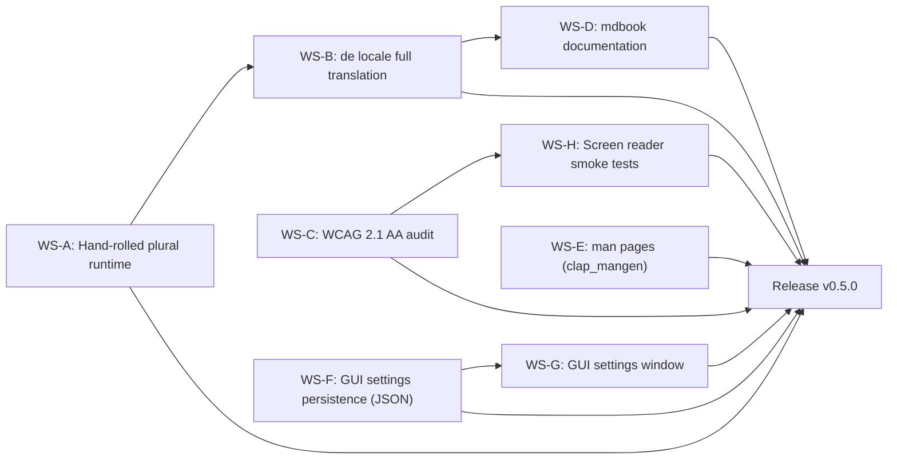

# Milestone 0.5.0 -- i18n + a11y + docs (2027-01-01 -> 2027-02-28)

| Field      | Value                                                                                                                            |
|------------|----------------------------------------------------------------------------------------------------------------------------------|
| Version    | `0.5.0`                                                                                                                          |
| Codename   | i18n + a11y + docs                                                                                                               |
| Window     | 2027-01-01 -> 2027-02-28 (8 weeks)                                                                                               |
| Owner      | _TBD_ (assign in planning meeting; see `AGENTS.md` for role selection)                                                           |
| Status     | `draft`                                                                                                                          |
| Parent     | `ROADMAP.md` -> Track B (GUI features), Track D (i18n + a11y + docs)                                                            |
| Predecessor| `0.4.0 -- QA + Security hardening` (planned 2026-12-31, tag `v0.4.0`)                                                            |
| Successor  | `1.0-rc.1 -- Distribution` (2027-03-01)                                                                                          |

## Goals

1. **Three localisations shipped with full parity.** English (`en.toml`), Russian (`ru.toml`) and German (`de.toml`) each contain every key in the i18n key set. German is a real translation, not a stub or machine-translated placeholder. The hand-rolled plural runtime selects the correct form for each locale at runtime.
2. **WCAG 2.1 AA audit completed.** Every GUI screen is audited for contrast ratios, focus order, keyboard navigation, and screen reader accessibility. The audit results are documented in `docs/a11y-audit.md` with pass/fail status per criterion and remediation tasks for any failures.
3. **`mdbook` documentation published.** A local `mdbook` project contains three books -- user guide, developer guide, and security model -- with at least 10 pages of content. Built via `mdbook build`; served locally via `mdbook serve`.
4. **`man` pages for the CLI.** `clap_mangen` generates a `supazip(1)` man page and a man page per subcommand from the clap definition. The pages are bundled in release artefacts.
5. **GUI settings persistence via JSON.** Theme override, language selection, max archive size, and recent files limit persist across sessions in `dirs::config_local_dir()/supazip/settings.json`.
6. **GUI settings window.** A new `egui::Window` provides a dedicated settings UI with controls for language, max archive size, and theme selection. The window coexists with the main window (multi-window support).
7. **Screen reader smoke test recipes documented.** `docs/a11y-testing.md` provides step-by-step NVDA (Windows) and VoiceOver (macOS) instructions for smoke-testing every major GUI flow.

## Non-goals

- **No new engine or backend features.** No new archive formats, no async traits, no streaming changes.
- **No new archive backends.** The backend set is frozen at the 0.4.0 surface.
- **No light theme.** Deferred to 1.1 per the 2026-06-06 decision. The settings window exposes the theme selector, but only "dark" is functional.
- **No distribution work.** No Homebrew, AUR, winget, scoop, or Nix packaging. Track E work resumes in 1.0-rc.1.
- **No `self_update` subcommand.** Deferred to 1.1 per the 2026-06-06 decision.
- **No `verify` subcommand (CRC + signature).** Deferred to a later milestone.
- **No `--quiet`, `--no-progress`, `--verbose` flags.** Deferred; CLI flag work is frozen at 0.4.0.
- **No ICU or Fluent dependency.** Hand-rolled plural logic is sufficient for en/ru/de (2-3 forms). ICU is revisited in 1.1 only if a complex-plural locale is requested.
- **No GitHub Pages deployment for mdbook.** Documentation is local-only per the 2026-06-07 decision.
- **No optional tutorial videos.** Deferred; only if 1.0-rc.1 budget allows.

## Workstreams

### WS-A -- Hand-rolled plural runtime selection

**Owner:** _TBD_ (core / i18n track)
**Estimated effort:** S

The 2026-06-07 decision established that SupaZip uses a hand-rolled plural-form function instead of ICU or Fluent. This workstream implements the runtime plural selection logic that reads the current locale and returns the correct plural form key for a given count.

Tasks:

1. Create or extend `supazip-core/src/i18n.rs` (or `supazip-gui/src/i18n.rs` if the GUI owns the runtime) with a `pub fn plural_form(locale: &str, n: usize) -> &'static str` function.
2. Implement plural rules for three locales:
   - `en`: 2 forms -- `one` (n == 1), `other`.
   - `ru`: 3 forms -- `one` (n % 10 == 1 && n % 100 != 11), `few` (n % 10 in 2..=4 && n % 100 not in 12..=14), `other`.
   - `de`: 2 forms -- `one` (n == 1), `other`.
3. Extend the TOML key lookup so that `t("archive.entries", 5)` resolves to `[archive.entries.other]` when locale is `en`, and to `[archive.entries.other]` for `de`, and to `[archive.entries.other]` for `ru` (with `one` / `few` variants as appropriate).
4. Add unit tests covering all plural edge cases for each locale: 0, 1, 2, 4, 5, 11, 21, 25, 111, 121.
5. Ensure the function is locale-agnostic at compile time: the locale string is resolved at runtime from the settings or system locale.
6. Document the plural rules in `docs/i18n-plural-rules.md` with examples for each locale.

Definition of done:

- `plural_form("en", 1)` returns `"one"`, `plural_form("en", 5)` returns `"other"`.
- `plural_form("ru", 21)` returns `"one"`, `plural_form("ru", 25)` returns `"few"`, `plural_form("ru", 111)` returns `"other"`.
- `plural_form("de", 1)` returns `"one"`, `plural_form("de", 2)` returns `"other"`.
- All unit tests pass under `cargo test -p supazip-core` (or `-p supazip-gui` depending on ownership).
- `docs/i18n-plural-rules.md` describes the rules with examples.

### WS-B -- German locale full translation (de.toml)

**Owner:** _TBD_ (i18n track)
**Estimated effort:** M

Tasks:

1. Copy `assets/i18n/ru.toml` as the template for `assets/i18n/de.toml`.
2. Translate every key to German, ensuring real human-quality translations (not machine-generated stubs). Pay attention to:
   - Formal "Sie" vs informal "du" -- use "Sie" for consistency.
   - Plural forms: `[key.one]` / `[key.other]` blocks matching the `de` plural rules from WS-A.
   - Compound nouns and string length (German strings are typically 20-30 % longer than English).
3. Verify key parity: every key present in `en.toml` and `ru.toml` must also exist in `de.toml`. Write a test or script that asserts key-set equality across all three locale files.
4. Add `de` to the locale selection logic in the i18n runtime (the `match locale` block or equivalent).
5. Add an integration test that loads `de.toml` and verifies that all keys resolve without fallback to English.
6. Test string rendering in the GUI: verify that longer German strings do not cause truncation, overflow, or layout breakage in egui widgets.

Definition of done:

- `assets/i18n/de.toml` exists and contains every key from `en.toml`.
- All translations are human-quality, formal German.
- `cargo test` passes with the de locale loaded.
- No GUI layout regressions when the locale is set to `de`.

### WS-C -- WCAG 2.1 AA audit

**Owner:** _TBD_ (a11y track)
**Estimated effort:** L

Tasks:

1. Create `docs/a11y-audit.md` as the audit report template with sections per WCAG 2.1 AA success criterion.
2. Audit every GUI screen against the following criteria (at minimum):
   - **1.1.1 Non-text Content** -- all icons and images have text alternatives.
   - **1.3.1 Info and Relationships** -- UI structure is programmatically determinable.
   - **1.4.1 Use of Colour** -- information is not conveyed by colour alone.
   - **1.4.3 Contrast (Minimum)** -- text contrast ratio >= 4.5:1 (normal text), >= 3:1 (large text).
   - **1.4.11 Non-text Contrast** -- UI component contrast ratio >= 3:1.
   - **2.1.1 Keyboard** -- all functionality is operable via keyboard.
   - **2.1.2 No Keyboard Trap** -- focus can be moved away from every component.
   - **2.4.3 Focus Order** -- focus moves in a meaningful sequence.
   - **2.4.7 Focus Visible** -- keyboard focus indicator is visible.
   - **4.1.2 Name, Role, Value** -- all components expose their name and role to assistive technology.
3. For each criterion, record: pass/fail status, the affected screen(s), screenshot or description of the issue, and a recommended fix.
4. File follow-up issues for every failed criterion with priority labels (P0 = blocking, P1 = must-fix-before-release, P2 = can-defer).
5. Verify that the dark theme contrast ratios meet AA thresholds using a contrast checker tool.
6. Run a manual keyboard-only navigation test through the main flows: open archive, extract, create, test, settings.

Definition of done:

- `docs/a11y-audit.md` contains a row for every audited WCAG 2.1 AA criterion.
- Every criterion has a pass/fail verdict and evidence.
- All P0 and P1 issues are resolved or have follow-up issues filed.
- The audit is reviewed and signed off by a second team member.

### WS-D -- mdbook documentation

**Owner:** _TBD_ (docs track)
**Estimated effort:** L

Tasks:

1. Initialise an `mdbook` project under `docs/book/` with `book.toml`:
   ```toml
   [book]
   title = "SupaZip Documentation"
   authors = ["SupaZip Contributors"]
   language = "en"
   src = "src"
   ```
2. Create the user guide (`docs/book/src/user-guide/`):
   - `getting-started.md` -- installation, first archive, basic commands.
   - `creating-archives.md` -- CLI and GUI workflows for all supported formats.
   - `extracting-archives.md` -- extraction, overwrite policies, password-protected archives.
   - `listing-entries.md` -- CLI `list` subcommand, `--output` formats.
   - `testing-archives.md` -- CLI `test` subcommand, interpreting results.
   - `localisation.md` -- how to switch languages, how to contribute translations.
3. Create the developer guide (`docs/book/src/dev-guide/`):
   - `building-from-source.md` -- toolchain requirements, `cargo build`, CI matrix.
   - `contributing.md` -- PR workflow, code style, commit conventions.
   - `testing.md` -- `cargo test`, fuzzing, property-based tests, coverage.
   - `adding-a-backend.md` -- step-by-step guide to implementing `ArchiveFormat` for a new format.
   - `i18n-workflow.md` -- how locale files work, how to add a new locale, plural rules.
4. Create the security model (`docs/book/src/security-model/`):
   - `overview.md` -- threat model, trust boundaries.
   - `path-traversal.md` -- `safe_join` design, property tests, known limitations.
   - `encryption.md` -- supported encryption methods, key derivation, limitations.
   - `fuzzing.md` -- harness design, CI integration, how to reproduce crashes.
   - `supply-chain.md` -- `cargo-audit`, `cargo-deny`, dependency policy.
5. Add a `SUMMARY.md` that defines the book structure and table of contents.
6. Verify that `mdbook build` produces a complete HTML site under `docs/book/book/`.
7. Verify that `mdbook serve` works locally and all internal links resolve.
8. Add a `docs/book/README.md` explaining how to build and serve the docs locally.

Definition of done:

- `mdbook build` completes with zero warnings.
- The user guide covers all CLI subcommands and GUI flows.
- The developer guide covers building, contributing, testing, adding a backend, and i18n.
- The security model covers the threat model, path traversal, encryption, fuzzing, and supply chain.
- All internal links resolve without 404.

### WS-E -- man pages for CLI (clap_mangen)

**Owner:** _TBD_ (CLI track)
**Estimated effort:** S

Tasks:

1. Add `clap_mangen = "0.2"` to `supazip-cli/Cargo.toml` under `[build-dependencies]` (or `[dependencies]` if generated at runtime).
2. Create a `build.rs` (or a CLI subcommand `supazip man`) that generates man pages from the clap `Command` definition using `clap_mangen::Man`.
3. Generate:
   - `supazip.1` -- the top-level man page with synopsis, description, and global options.
   - `supazip-list.1`, `supazip-extract.1`, `supazip-create.1`, `supazip-test.1`, `supazip-completions.1` -- one page per subcommand.
4. Commit the generated man pages under `supazip-cli/man/`.
5. Add an integration test that verifies each man page file exists and is non-empty.
6. Document the man page generation workflow in `docs/cli-man-pages.md`.
7. Include the man pages in the release artefacts (add to the GitHub Releases workflow).

Definition of done:

- `supazip-cli/man/supazip.1` exists and contains a valid roff-formatted man page.
- One man page per subcommand exists under `supazip-cli/man/`.
- Integration tests pass under `cargo test -p supazip-cli`.
- `docs/cli-man-pages.md` describes the generation workflow.

### WS-F -- GUI settings persistence (JSON)

**Owner:** _TBD_ (GUI track)
**Estimated effort:** M

The 2026-06-07 decision specifies that settings persist as JSON in `dirs::config_local_dir()/supazip/settings.json`, matching the pattern used by `recent_files.json`.

Tasks:

1. Create `supazip-gui/src/settings.rs` with a `Settings` struct:
   ```rust
   pub struct Settings {
       pub language: Option<String>,       // e.g. "en", "ru", "de"; None = system default
       pub theme: String,                   // "dark" (only option in 0.5)
       pub max_archive_size_mb: u64,        // default: 4096
       pub recent_files_limit: usize,       // default: 10
   }
   ```
2. Implement `Settings::load()` that reads `dirs::config_local_dir()/supazip/settings.json` and deserializes with `serde_json`. Returns defaults if the file is missing or malformed.
3. Implement `Settings::save()` that serializes and writes the JSON file. Create the parent directory if it does not exist.
4. Call `Settings::load()` once at GUI startup and `Settings::save()` whenever a setting changes.
5. Add migration logic: if the settings file contains unknown keys (from a newer version), ignore them silently; if required keys are missing, fill with defaults.
6. Add unit tests for: load missing file (returns defaults), load malformed JSON (returns defaults), save-then-load round-trip, unknown keys are ignored, missing keys are defaulted.
7. Document the settings file format in `docs/gui-settings.md`.

Definition of done:

- `settings.json` is created on first run at `dirs::config_local_dir()/supazip/settings.json`.
- Closing and reopening the GUI preserves the language, theme, max archive size, and recent files limit.
- Malformed or missing settings files do not crash the application.
- Unit tests pass under `cargo test -p supazip-gui`.

### WS-G -- GUI settings window (egui::Window)

**Owner:** _TBD_ (GUI track)
**Estimated effort:** M

Tasks:

1. Create `supazip-gui/src/windows/settings_window.rs` with a `SettingsWindow` struct that holds the current `Settings` (from WS-F) and an `is_open` flag.
2. Render an `egui::Window` with the following controls:
   - **Language** -- `egui::ComboBox` with options: "System default", "English", "Russian", "German". Changing the selection updates `Settings.language` and triggers a locale reload.
   - **Max archive size** -- `egui::Slider` or `egui::DragValue` with range 64..=16384 MB. Changing the value updates `Settings.max_archive_size_mb`.
   - **Theme** -- `egui::ComboBox` with options: "Dark". (Light is greyed out or hidden with a tooltip: "Deferred to 1.1".)
3. Add a "Reset to defaults" button that reverts all settings to their default values.
4. Add an "Apply" / "Close" button that saves the settings via `Settings::save()`.
5. Wire the settings window to the main window's menu bar: "File > Settings" (or "Edit > Preferences") opens the settings window.
6. Ensure the settings window coexists with the main window without blocking the event loop (non-modal `egui::Window`).
7. Verify that changing the language in the settings window updates the UI text immediately (or on next startup if immediate reload is too complex).
8. Add integration tests that open the settings window, change a value, close, and verify the setting persisted.

Definition of done:

- "File > Settings" opens a non-modal settings window.
- Language, max archive size, and theme controls function correctly.
- Settings persist across GUI restarts.
- The "Reset to defaults" button works.
- Changing the language updates UI strings (immediately or on restart).

### WS-H -- Screen reader smoke tests (docs)

**Owner:** _TBD_ (a11y track)
**Estimated effort:** S

Tasks:

1. Create `docs/a11y-testing.md` with screen reader smoke test recipes for:
   - **NVDA** (Windows) -- how to install, how to navigate SupaZip's GUI, what to listen for.
   - **VoiceOver** (macOS) -- how to enable, how to navigate, key shortcuts.
2. For each screen reader, document test cases:
   - Launch SupaZip and verify the window title is announced.
   - Tab through all interactive elements and verify focus order matches visual order.
   - Open an archive and verify entry list items are announced with name, size, and type.
   - Trigger the extract action and verify the progress dialog announces progress.
   - Open the settings window and verify all controls are labelled and announced.
3. Include a checklist template that QA can copy and fill during each release.
4. Note the current state of egui's accessibility support (egui exposes accessibility via the `AccessKit` crate) and any known limitations.
5. Add a section on how to run the tests with the `AX_API` environment variable or egui's built-in accessibility inspector.

Definition of done:

- `docs/a11y-testing.md` exists with NVDA and VoiceOver recipes.
- Each recipe covers at least 5 test cases.
- A QA checklist template is included.
- Known egui accessibility limitations are documented.

## Dependency graph



Reading the graph:

- **WS-A** (plural runtime) blocks **WS-B** (de translation) because the German locale file needs plural form keys that depend on the runtime logic.
- **WS-B** blocks **WS-D** (mdbook) only in that the user-guide localisation page references the concrete de.toml; the rest of the book can be written in parallel.
- **WS-C** (WCAG audit) blocks **WS-H** (screen reader smoke tests) because the audit identifies the screens that need testing.
- **WS-F** (settings persistence) blocks **WS-G** (settings window) because the window reads and writes `Settings`.
- **WS-D** (mdbook), **WS-E** (man pages), **WS-A**, **WS-C**, **WS-F** are independent and can be worked on in parallel.
- All workstreams converge on the `Release v0.5.0` gate.

## Release checklist

This list mirrors the release criteria in `ROADMAP.md` -> "Release criteria per version -> 0.5.0", expanded into per-item action checkboxes. Issue / PR numbers are placeholders.

- [ ] Three localisations shipped (`en.toml`, `ru.toml`, `de.toml`) with full key parity. -- `<issue/PR #N>` (WS-A, WS-B)
- [ ] Hand-rolled plural runtime passes all unit tests for en/ru/de. -- `<issue/PR #N>` (WS-A)
- [ ] WCAG 2.1 AA audit completed; `docs/a11y-audit.md` published with pass/fail per criterion. -- `<issue/PR #N>` (WS-C)
- [ ] All P0 and P1 a11y issues resolved. -- `<issue/PR #N>` (WS-C)
- [ ] `mdbook build` produces zero warnings; user-guide, dev-guide, and security-model are complete. -- `<issue/PR #N>` (WS-D)
- [ ] Man pages generated for `supazip(1)` and all subcommands; bundled in release artefacts. -- `<issue/PR #N>` (WS-E)
- [ ] GUI settings persist across restarts via `settings.json`. -- `<issue/PR #N>` (WS-F)
- [ ] GUI settings window accessible via "File > Settings" with language, max archive size, and theme controls. -- `<issue/PR #N>` (WS-G)
- [ ] Screen reader smoke test recipes documented in `docs/a11y-testing.md`. -- `<issue/PR #N>` (WS-H)
- [ ] GUI feature-complete against the 0.3.0 + 0.5.0 backlog (multi-window, settings persistence). -- `<issue/PR #N>` (WS-F, WS-G)
- [ ] `CHANGELOG.md` updated with a "0.5.0 -- i18n + a11y + docs" section; tag `v0.5.0` pushed. -- `<issue/PR #N>` (release workstream)
- [ ] `cargo test --workspace` is green on `windows-latest`, `ubuntu-latest`, `macos-latest`, `macos-14`. -- `<issue/PR #N>`
- [ ] No regressions in fuzzing, coverage, or security gates from 0.4.0. -- `<issue/PR #N>`

## New dependencies

| Name              | Version | License         | Purpose                                                  | Notes                                                                                          |
|-------------------|---------|-----------------|----------------------------------------------------------|------------------------------------------------------------------------------------------------|
| `clap_mangen`     | `0.2`   | MIT / Apache-2.0| Man page generation from clap `Command` definitions       | Build-dependency or runtime dependency of `supazip-cli`.                                       |
| `mdbook`          | `0.4`   | MPL-2.0         | Static documentation site generator                       | CI/dev tool, installed via `cargo install mdbook`. Not a crate dependency.                     |
| `dirs`            | `5`     | MIT / Apache-2.0| Platform-specific config directory resolution             | Already a transitive dependency of `supazip-gui`; promoted to direct for `config_local_dir()`. |

`dirs` is already present as a transitive dependency via `rfd` or `eframe`; promoting it to a direct dependency is a metadata change, not a new crate in the tree. `clap_mangen` adds no new transitive dependencies. `mdbook` is a dev tool, not a binary dependency. All licences are compatible with the SupaZip dual-licence (MIT or Apache-2.0), except `mdbook` which is MPL-2.0 -- acceptable because it is a build tool, not linked into the binary.

## Risk register

| # | Risk                                                                                                          | Likelihood | Impact | Mitigation                                                                                                                                                                                                                                                |
|---|---------------------------------------------------------------------------------------------------------------|------------|--------|-----------------------------------------------------------------------------------------------------------------------------------------------------------------------------------------------------------------------------------------------------------|
| 1 | German translations are low quality or inconsistent ("Sie" vs "du").                                         | Medium     | Medium | Assign a native or fluent German speaker for review. Use a translation style guide specifying formal "Sie". Run the translations through a second-pass review before merging.                                                                             |
| 2 | egui accessibility support (via AccessKit) is incomplete; some WCAG criteria cannot be met at the framework level. | High       | Medium | Document known egui limitations in `docs/a11y-audit.md`. File upstream issues on the egui repository for any blocking limitations. Mark framework-limited criteria as "deferred to 1.1" with justification.                                                |
| 3 | Longer German strings cause GUI layout breakage (text truncation, overflow).                                  | Medium     | Medium | Test all German strings in the GUI before merging WS-B. Add `egui::ScrollArea` or flexible layouts to long-text widgets. Cap button labels at a reasonable length; use tooltips for full text.                                                            |
| 4 | `mdbook` content becomes stale quickly as the codebase evolves.                                               | Medium     | Low    | Pin the documentation to the 0.5.0 feature set. Add a CI check that builds `mdbook` and fails on warnings. Create a `docs/update-checklist.md` for release reviewers.                                                                                    |
| 5 | `clap_mangen` generates incorrect or incomplete man pages for complex subcommand definitions.                  | Low        | Low    | Manually review the generated pages against the `--help` output. Add an integration test that runs `man -l supazip-cli/man/supazip.1` (or equivalent) and checks for key section headers.                                                                  |
| 6 | Settings persistence conflicts between concurrent GUI instances (e.g. two windows writing to the same file).   | Low        | Medium | Use file-level locking (`fs2` crate) or write-on-exit semantics. If locking is too complex for 0.5, document the limitation (single instance) and defer to 1.1.                                                                                           |
| 7 | Screen reader smoke tests are never re-run because they require manual NVDA/VoiceOver setup.                   | Medium     | Low    | Include the smoke test checklist in the release checklist. Add a note in `CONTRIBUTING.md` about when to run a11y tests. Consider automating with `cargo test --features a11y-test` if AccessKit exposes a test harness in the future.                     |

## Open questions

1. **Where does the plural runtime live: `supazip-core` or `supazip-gui`?** Default: `supazip-core/src/i18n.rs` because the CLI may also need plural forms for output messages. The GUI imports it as a library function. Revisit if the core crate should remain i18n-agnostic.
2. **Should `Settings` be shared between GUI and CLI?** Default: no. The CLI does not have persistent settings (it uses flags). `Settings` lives in `supazip-gui` only. Revisit if the CLI ever needs a config file (e.g. for default output format).
3. **Immediate locale switch vs restart-required?** Default for 0.5: restart-required. Changing the language in the settings window shows a tooltip: "Restart SupaZip to apply the new language." Immediate hot-reload is deferred to 1.1 because it requires rebuilding all UI strings in the current frame.
4. **mdbook monorepo vs per-book repos?** Default: monorepo. All three books live under `docs/book/` with a single `book.toml` and separate `src/` subdirectories. This keeps the build simple and avoids three separate `mdbook` invocations.
5. **Should the settings window use `egui::Window` or a dedicated `egui::Panel`?** Default: `egui::Window` (non-modal). A panel would require layout changes to the main window; a window is self-contained and matches the multi-window support requirement. Revisit if the settings UI grows significantly in 1.1.
6. **Should `clap_mangen` be a build-dependency (generating at compile time) or a runtime dependency (generating on demand)?** Default: build-dependency with `build.rs`. The man pages are committed to the repo and bundled in releases; runtime generation is unnecessary. Revisit if the CLI needs a `supazip man` subcommand for on-demand generation.
