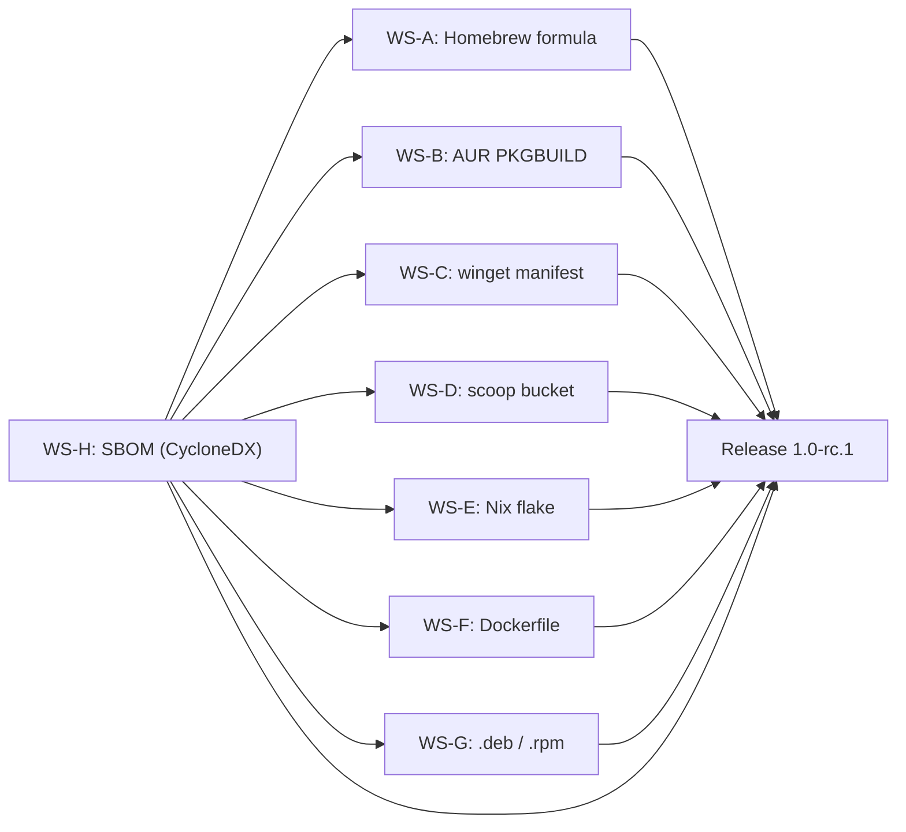

# Milestone 1.0-rc.1 -- Distribution (2027-03-01 -> 2027-04-30)

| Field       | Value                                                                                                                           |
|-------------|---------------------------------------------------------------------------------------------------------------------------------|
| Version     | `1.0-rc.1`                                                                                                                      |
| Codename    | Distribution                                                                                                                    |
| Window      | 2027-03-01 -> 2027-04-30 (8 weeks)                                                                                              |
| Owner       | _TBD_ (assign in planning meeting; see `AGENTS.md` for role selection)                                                          |
| Status      | `draft`                                                                                                                         |
| Parent      | `ROADMAP.md` -> Track E (Distribution / Packaging)                                                                              |
| Predecessor | `0.5.0 -- i18n + a11y + docs` (planned 2027-02-28, tag `v0.5.0`)                                                               |
| Successor   | `1.0.0 -- Production` (2027-05-01)                                                                                              |

## Goals

1. **Homebrew formula published via community tap.** A `homebrew-supazip` tap repository provides a formula that installs the latest release binary on macOS (x64 and arm64) and Linux (x64). The formula passes `brew audit --strict` and `brew test`.
2. **AUR package maintained.** A `PKGBUILD` for the `supazip` package is published on the AUR, building from source with `cargo`. It follows AUR packaging guidelines, passes `namcap` checks, and installs man pages, shell completions, and the desktop file.
3. **winget manifest submitted.** A winget manifest (v1.6 schema) is authored via `wingetcreate` and submitted to `microsoft/winget-pkgs`. It covers Windows x64, installs the binary and the `.desktop` file equivalent, and passes `winget validate`.
4. **Scoop bucket published.** A `scoop-supazip` bucket repository provides a JSON manifest for Windows x64. It points to the GitHub Release asset, includes hash verification, and passes `scoop install supazip` from a clean environment.
5. **Nix flake and overlay shipped.** A `flake.nix` at the repository root builds `supazip-cli` and `supazip-gui` via `crane` or `naersk`, exposes an overlay for downstream Nix users, and includes a `devShells.default` for contributors. The flake passes `nix flake check`.
6. **Distroless Docker image published.** A multi-stage `Dockerfile` builds a static `supazip-cli` binary and copies it into a `gcr.io/distroless/static-debian12` base. The image is published to GitHub Container Registry (`ghcr.io`) with each release.
7. **`.deb` and `.rpm` packages built and published.** `cargo-deb` produces `.deb` packages for amd64 and arm64; `cargo-rpm` (or manual spec) produces `.rpm` packages for x86_64. Packages include the binary, man pages, shell completions, and a desktop entry. Both are attached to GitHub Releases.
8. **CycloneDX SBOM attached to every release.** A CycloneDX 1.5 SBOM (JSON) is generated during the release workflow using `cargo-cyclonedx` or `syft`. It covers all first-party and transitive dependencies. The SBOM is verified by `bom` CLI before upload.
9. **Signed checksums and reproducible-build verification.** Every release artefact has a SHA-256 checksum file signed with `minisign`. The release workflow includes a reproducible-build verification step that rebuilds from source and compares hashes.

## Non-goals

- **No new engine or backend features.** The archive engine is frozen at the 0.5.0 surface. No new formats, no async traits, no streaming changes.
- **No GUI changes.** The GUI surface is frozen at the 0.5.0 feature set. No new windows, dialogs, or widgets.
- **No new CLI features.** The CLI surface is frozen at the 0.4.0 + 0.5.0 backlog. No new subcommands, flags, or output formats.
- **No `self_update` subcommand.** Deferred to 1.1 per the 2026-06-06 decision. Users update through their package manager.
- **No light theme.** Deferred to 1.1 per the 2026-06-06 decision.
- **No mobile targets.** iOS and Android are out of scope for 1.0.
- **No plugin system.** Deferred to post-1.0.
- **No Flatpak or Snap packages.** Not in the ROADMAP; can be added in 1.1 if demand surfaces.
- **No Windows ARM64 packages.** The initial distribution targets x64 only on Windows. ARM64 is deferred to 1.1.
- **No macOS notarization.** Apple notarization requires an Apple Developer account and is deferred to a post-1.0 follow-up.

## Workstreams

### WS-A -- Homebrew formula (homebrew-supazip tap)

**Owner:** _TBD_ (distribution track)
**Estimated effort:** M

A dedicated `homebrew-supazip` tap repository provides a formula that installs pre-built binaries from GitHub Releases. This is the primary installation method on macOS and Linux.

Tasks:

1. Create a `supazip` repository under the project's GitHub org (or a personal account) at `homebrew-supazip`. The repo name follows the `homebrew-<tap>` convention so that `brew tap supazip/supazip` works.
2. Author `Formula/supazip.rb` with the following structure:
   - `desc`, `homepage`, `version`, `license "Apache-2.0"`.
   - `on_macos` block downloading the correct binary for `x86_64` or `arm64` from the GitHub Release.
   - `on_linux` block downloading the `x86_64` binary.
   - `install` block copying `supazip-cli` and `supazip-gui` to `bin/`, man pages to `man/man1/`, shell completions to the appropriate locations.
   - `test` block running `supazip --version` and a basic `supazip list` on a test archive.
3. Verify that `brew install --build-from-source supazip/supazip/supazip` works as a fallback (requires Rust toolchain).
4. Add a CI job (`.github/workflows/homebrew.yml`) that runs on each release tag, downloads the release assets, and runs `brew audit --strict` and `brew test` against the formula.
5. Submit a PR to `homebrew-core` once the formula is stable (after at least one point release). Track the PR status in the release checklist.
6. Document the Homebrew installation in `docs/book/src/user-guide/getting-started.md` (or equivalent).

Definition of done:

- `brew tap supazip/supazip && brew install supazip` installs the latest release on macOS (x64 and arm64) and Linux (x64).
- `brew audit --strict supazip/supazip/supazip` passes with no warnings.
- `brew test supazip/supazip/supazip` passes.
- CI job validates the formula on each release tag.
- Installation documented in the user guide.

### WS-B -- AUR PKGBUILD

**Owner:** _TBD_ (distribution track)
**Estimated effort:** M

An AUR package `supazip` builds from source using the Rust toolchain and installs all artefacts (binary, man pages, completions, desktop file).

Tasks:

1. Create a `PKGBUILD` following the Arch Linux packaging guidelines:
   - `pkgname=supazip`
   - `pkgver` derived from the latest release tag.
   - `makedepends=(cargo)` and `depends=(gcc-libs)` (minimal runtime deps).
   - `source=("git+https://github.com/supazip/supazip.git#tag=v${pkgver}")`.
   - `prepare()` runs `cargo fetch --locked`.
   - `build()` runs `cargo build --release --locked -p supazip-cli -p supazip-gui`.
   - `package()` installs binaries, man pages, shell completions, and the `.desktop` file.
2. Add a `.SRCINFO` file generated by `makepkg --printsrcinfo`.
3. Verify that `makepkg -si` builds and installs cleanly on a clean Arch environment (Docker or VM).
4. Run `namcap PKGBUILD` and `namcap supazip-*.pkg.tar.zst` and fix all warnings.
5. Publish the package on the AUR (or provide instructions for manual submission).
6. Add a CI job (`.github/workflows/aur.yml`) that builds the package in an Arch Docker container on each release tag and runs `namcap`.
7. Document the AUR installation in the user guide.

Definition of done:

- `yay -S supazip` (or `paru -S supazip`) builds and installs the latest release.
- `namcap` reports no errors or warnings.
- CI job validates the PKGBUILD on each release tag.
- Installation documented in the user guide.

### WS-C -- winget manifest

**Owner:** _TBD_ (distribution track)
**Estimated effort:** M

A winget manifest allows `winget install supazip` on Windows x64.

Tasks:

1. Generate a winget manifest (v1.6 schema) using `wingetcreate`:
   - `PackageIdentifier`: `SupaZip.SupaZip` (or as approved by the winget team).
   - `PackageVersion`: matches the release tag.
   - `InstallerType`: `zip` (containing the `.exe` binary) or `inno`/`msi` if an installer is created.
   - `Installers`: one entry per architecture (`x64`), pointing to the GitHub Release asset URL.
   - `ManifestType`: `version`, `installer`, `defaultLocale`, `locale`.
2. Validate the manifest with `winget validate --manifest <path>`.
3. Test installation with `winget install --manifest <path>` on a clean Windows environment.
4. Submit the manifest to `microsoft/winget-pkgs` via PR. Track the PR status.
5. Add a CI job (`.github/workflows/winget.yml`) that generates and validates the manifest on each release tag.
6. Document the winget installation in the user guide.

Definition of done:

- `winget install SupaZip.SupaZip` installs the latest release on Windows x64.
- `winget validate` passes on the manifest.
- Manifest PR submitted to `microsoft/winget-pkgs`.
- CI job validates the manifest on each release tag.
- Installation documented in the user guide.

### WS-D -- scoop bucket

**Owner:** _TBD_ (distribution track)
**Estimated effort:** S

A scoop bucket provides JSON manifests for Windows x64.

Tasks:

1. Create a `scoop-supazip` repository under the project's GitHub org.
2. Author `bucket/supazip.json` with:
   - `version`: matches the release tag.
   - `architecture.x64.url`: points to the GitHub Release zip asset.
   - `architecture.x64.hash`: SHA-256 hash of the asset (updated by CI).
   - `bin`: `["supazip.exe"]`.
   - `checkver.github`: auto-detects the latest release.
   - `autoupdate.architecture.x64.url`: template for automatic hash updates.
3. Verify that `scoop bucket add supazip https://github.com/supazip/scoop-supazip && scoop install supazip` works from a clean Windows environment.
4. Add a CI job that updates the hash in the manifest on each release (via `scoop-autoupdate` or a custom script).
5. Document the scoop installation in the user guide.

Definition of done:

- `scoop install supazip` from the bucket installs the latest release on Windows x64.
- Auto-update mechanism keeps the manifest in sync with GitHub Releases.
- Installation documented in the user guide.

### WS-E -- Nix flake and overlay

**Owner:** _TBD_ (distribution track)
**Estimated effort:** L

A Nix flake at the repository root builds SupaZip from source using `crane` (or `naersk`) and exposes an overlay for downstream Nix users.

Tasks:

1. Create `flake.nix` at the repository root:
   - `inputs`: `nixpkgs`, `flake-utils`, `crane` (or `naersk`), `rust-overlay`.
   - `outputs`: `packages.<system>.supazip-cli`, `packages.<system>.supazip-gui`, `overlays.default`.
   - `devShells.<system>.default`: a development shell with Rust toolchain, `cargo-deb`, `cargo-cyclonedx`, and other dev tools.
2. Create `flake.lock` and commit it.
3. Ensure `nix build .#supazip-cli` produces a working binary for `x86_64-linux` and `aarch64-linux`.
4. Ensure `nix build .#supazip-gui` produces a working binary (GUI may need X11/Wayland dependencies handled via `nix-filter` or `LD_LIBRARY_PATH`).
5. Verify `nix flake check` passes (lint, build, tests).
6. Publish the flake to `nixpkgs` (optional, post-RC). For the RC, the flake is consumed directly from the repo.
7. Add a CI job (`.github/workflows/nix.yml`) that runs `nix flake check` on each PR and release tag.
8. Document the Nix installation in the user guide.

Definition of done:

- `nix build github:supazip/supazip#supazip-cli` produces a working binary.
- `nix build github:supazip/supazip#supazip-gui` produces a working binary (if GUI build is feasible in Nix).
- `nix flake check` passes in CI.
- Overlay works: `nix shell github:supazip/supazip#supazip-cli` runs `supazip --version`.
- Installation documented in the user guide.

### WS-F -- Dockerfile (distroless)

**Owner:** _TBD_ (distribution track)
**Estimated effort:** M

A multi-stage Dockerfile builds a static `supazip-cli` binary and packages it in a distroless image.

Tasks:

1. Create `Dockerfile` at the repository root:
   - **Stage 1 (`builder`)**: `rust:1.82-bookworm` base, install build deps, `cargo build --release --locked -p supazip-cli`, strip the binary.
   - **Stage 2 (`runtime`)**: `gcr.io/distroless/static-debian12` base, copy the stripped binary as `/usr/local/bin/supazip`, set `ENTRYPOINT ["/usr/local/bin/supazip"]`.
2. Create `.dockerignore` to exclude `target/`, `.git/`, `docs/`, and other non-essential files.
3. Verify that `docker build -t supazip .` builds successfully and `docker run --rm supazip --version` returns the expected version.
4. Verify that the image size is under 50 MB.
5. Add a CI job (`.github/workflows/docker.yml`) that builds the image, runs a smoke test, and pushes to `ghcr.io/supazip/supazip` on each release tag.
6. Tag images with `latest`, the release version, and the major.minor version (e.g., `1.0`).
7. Document the Docker installation in the user guide.

Definition of done:

- `docker run --rm ghcr.io/supazip/supazip:latest --version` returns the correct version.
- Image size is under 50 MB.
- CI job builds and pushes the image on each release tag.
- Installation documented in the user guide.

### WS-G -- .deb and .rpm packages (cargo-deb + cargo-rpm)

**Owner:** _TBD_ (distribution track)
**Estimated effort:** L

Native Linux packages for Debian/Ubuntu (`.deb`) and Fedora/RHEL (`.rpm`).

Tasks:

1. Add `cargo-deb` configuration to `supazip-cli/Cargo.toml`:
   ```toml
   [package.metadata.deb]
   maintainer = "SupaZip Contributors <supazip@example.com>"
   copyright = "2026-2027 SupaZip Contributors"
   license-file = ["LICENSE-MIT", "LICENSE-APACHE"]
   extended-description = "A fast, secure cross-platform archiver"
   section = "utils"
   priority = "optional"
   assets = [
       ["target/release/supazip", "usr/bin/", "755"],
       ["supazip-cli/man/supazip.1", "usr/share/man/man1/", "644"],
       ["supazip-cli/completions/supazip.bash", "usr/share/bash-completion/completions/supazip", "644"],
       ["supazip-cli/completions/_supazip", "usr/share/zsh/vendor-completions/_supazip", "644"],
       ["supazip-cli/completions/supazip.fish", "usr/share/fish/vendor_completions.d/supazip.fish", "644"],
   ]
   ```
2. Build `.deb` for amd64 and arm64 using `cargo deb --target x86_64-unknown-linux-gnu` and `cargo deb --target aarch64-unknown-linux-gnu` (cross-compilation via `cross`).
3. Validate `.deb` packages with `lintian --no-tag-display-limit`.
4. Create a `supazip.spec` file for `cargo-rpm` (or manual `rpmbuild`):
   - `Name: supazip`, `Version: <from tag>`, `License: MIT OR Apache-2.0`.
   - Build with `cargo build --release --locked`.
   - Install binary, man pages, completions, desktop file.
5. Build `.rpm` for x86_64 using `cargo rpm build` or `rpmbuild`.
6. Validate `.rpm` packages with `rpmlint`.
7. Add a CI job (`.github/workflows/linux-packages.yml`) that builds `.deb` and `.rpm` on each release tag, runs lint checks, and attaches packages to the GitHub Release.
8. Document the `.deb` and `.rpm` installation in the user guide (including manual repository setup if not in upstream repos).

Definition of done:

- `dpkg -i supazip_<version>_amd64.deb` installs the binary, man pages, and completions on Ubuntu.
- `rpm -i supazip-<version>.x86_64.rpm` installs the binary, man pages, and completions on Fedora.
- `lintian` and `rpmlint` report no errors.
- CI job builds and attaches packages on each release tag.
- Installation documented in the user guide.

### WS-H -- SBOM (CycloneDX) in release workflow

**Owner:** _TBD_ (distribution track)
**Estimated effort:** M

A CycloneDX 1.5 SBOM is generated during the release workflow and attached to every GitHub Release.

Tasks:

1. Add `cargo-cyclonedx` (or `syft` with Cargo support) as a CI tool:
   - `cargo install cargo-cyclonedx` in the CI workflow.
   - Run `cargo cyclonedx --output-format json --output-file sbom.json` for the workspace.
2. Validate the SBOM with `cyclonedx-cli validate --input-file sbom.json --input-format json --input-version v1_5`.
3. Verify that the SBOM includes:
   - All first-party crates (`supazip-core`, `supazip-cli`, `supazip-gui`).
   - All transitive dependencies with correct versions, licenses, and PURLs.
   - The SupaZip project itself as the root component.
4. Attach `sbom.json` and `sbom.json.sig` (signed with `minisign`) to the GitHub Release.
5. Add a SHA-256 checksums file (`SHA256SUMS.txt`) covering all release artefacts (binaries, packages, SBOM). Sign the checksums file with `minisign`.
6. Add a reproducible-build verification step:
   - Rebuild from source using the pinned toolchain and `SOURCE_DATE_EPOCH`.
   - Compare the resulting binary hash against the released binary hash.
   - Fail the release if the hashes do not match.
7. Document the SBOM, checksums, and verification process in `docs/book/src/security-model/supply-chain.md`.

Definition of done:

- `sbom.json` is a valid CycloneDX 1.5 document covering all dependencies.
- `SHA256SUMS.txt` is signed with `minisign` and attached to the release.
- Reproducible-build verification step passes in the release workflow.
- Verification process documented in the security model.

## Dependency graph



Reading the graph:

- **WS-H** (SBOM) is a dependency of all other workstreams because every package manager installation path should reference the SBOM and signed checksums in the release. In practice, WS-H can be developed in parallel with the other workstreams; the dependency is at the release gate, not at development time.
- **WS-A** through **WS-G** are independent of each other and can be worked on in parallel.
- All workstreams converge on the `Release 1.0-rc.1` gate.

## Release checklist

This list mirrors the release criteria in `ROADMAP.md` -> "Release criteria per version -> 1.0-rc.1", expanded into per-item action checkboxes. Issue / PR numbers are placeholders.

- [ ] Homebrew formula published via `supazip/supazip` tap; `brew install supazip` works on macOS and Linux. -- `<issue/PR #N>` (WS-A)
- [ ] AUR package `supazip` published; `yay -S supazip` builds and installs. -- `<issue/PR #N>` (WS-B)
- [ ] winget manifest submitted to `microsoft/winget-pkgs`; `winget install SupaZip.SupaZip` works. -- `<issue/PR #N>` (WS-C)
- [ ] scoop bucket published; `scoop install supazip` works. -- `<issue/PR #N>` (WS-D)
- [ ] Nix flake builds and `nix flake check` passes. -- `<issue/PR #N>` (WS-E)
- [ ] Docker image published to `ghcr.io/supazip/supazip`; `docker run --rm ghcr.io/supazip/supazip --version` works. -- `<issue/PR #N>` (WS-F)
- [ ] `.deb` packages for amd64 and arm64 attached to the release; `dpkg -i` installs cleanly. -- `<issue/PR #N>` (WS-G)
- [ ] `.rpm` package for x86_64 attached to the release; `rpm -i` installs cleanly. -- `<issue/PR #N>` (WS-G)
- [ ] CycloneDX SBOM (`sbom.json`) attached to the release and validated. -- `<issue/PR #N>` (WS-H)
- [ ] `SHA256SUMS.txt` signed with `minisign` and attached to the release. -- `<issue/PR #N>` (WS-H)
- [ ] Reproducible-build verification step passes in the release workflow. -- `<issue/PR #N>` (WS-H)
- [ ] Tag `1.0-rc-1` pushed. -- `<issue/PR #N>` (release workstream)
- [ ] `CHANGELOG.md` updated with a "1.0-rc.1 -- Distribution" section. -- `<issue/PR #N>` (release workstream)
- [ ] `cargo test --workspace` is green on `windows-latest`, `ubuntu-latest`, `macos-latest`, `macos-14`. -- `<issue/PR #N>`
- [ ] No regressions in fuzzing, coverage, or security gates from 0.5.0. -- `<issue/PR #N>`
- [ ] All package manager installations documented in the user guide. -- `<issue/PR #N>` (all WS)

## New dependencies

| Name                  | Version | License           | Purpose                                        | Notes                                                                                          |
|-----------------------|---------|-------------------|-------------------------------------------------|------------------------------------------------------------------------------------------------|
| `cargo-deb`           | `2`     | MIT / Apache-2.0  | `.deb` package generation from Cargo metadata   | Dev tool, installed via `cargo install cargo-deb`. Not a crate dependency.                     |
| `cargo-rpm`           | `0.14`  | MIT / Apache-2.0  | `.rpm` package generation from Cargo metadata   | Dev tool, installed via `cargo install cargo-rpm`. Not a crate dependency.                     |
| `cargo-cyclonedx`     | `0.5`   | Apache-2.0        | CycloneDX SBOM generation for Rust projects     | Dev tool, installed via `cargo install cargo-cyclonedx`. Not a crate dependency.               |
| `minisign`            | `0.11`  | ISC               | Signing of checksums and release artefacts      | System tool, installed via package manager or `cargo install minisign`. Not a crate dependency.|
| `crane`               | -       | MIT               | Nix build framework for Rust/Cargo projects     | Nix flake input. Not a crate dependency.                                                       |

All listed dependencies are dev tools, CI tools, or Nix flake inputs. None are linked into the SupaZip binary at runtime. All licences are compatible with the SupaZip dual-licence (MIT or Apache-2.0).

## Risk register

| # | Risk                                                                                                         | Likelihood | Impact | Mitigation                                                                                                                                                                                                                                                |
|---|--------------------------------------------------------------------------------------------------------------|------------|--------|-----------------------------------------------------------------------------------------------------------------------------------------------------------------------------------------------------------------------------------------------------------|
| 1 | Homebrew formula PR to `homebrew-core` is rejected or delayed due to audit failures.                         | Medium     | Low    | Use a community tap (`homebrew-supazip`) as the primary distribution channel. Submit `homebrew-core` PR only after the formula is stable and passes `brew audit --strict`. Document the tap installation as the primary path.                               |
| 2 | AUR package fails `namcap` due to missing dependencies or incorrect permissions.                             | Low        | Low    | Test the PKGBUILD in a clean Arch Docker container before publishing. Run `namcap` locally and in CI before submission.                                                                                                                                    |
| 3 | winget manifest PR is rejected due to naming conflicts or policy violations.                                 | Medium     | Medium | Research `microsoft/winget-pkgs` naming conventions before authoring. Use `wingetcreate` to generate a compliant manifest. Test with `winget validate` before submission.                                                                                  |
| 4 | Nix flake fails to build `supazip-gui` due to missing X11/Wayland system dependencies.                       | High       | Low    | Focus the flake on `supazip-cli` for the RC. Mark `supazip-gui` as `meta.broken = true` on Nix with a note explaining the GUI dependency issue. Fix in 1.0.0 or 1.1.                                                                                      |
| 5 | Cross-compilation for `.deb` arm64 fails or produces broken binaries.                                         | Medium     | Medium | Use `cross` for arm64 builds. Test the resulting `.deb` on an arm64 host (Raspberry Pi, AWS Graviton, or QEMU) before release.                                                                                                                            |
| 6 | SBOM tool (`cargo-cyclonedx` or `syft`) misses transitive dependencies or produces invalid CycloneDX output. | Medium     | Medium | Validate the SBOM with `cyclonedx-cli validate`. Cross-check the dependency list against `cargo tree`. File upstream bugs for any missing dependencies.                                                                                                   |
| 7 | Reproducible-build verification fails due to non-deterministic build (timestamps, paths, random seeds).       | Medium     | High   | Pin `SOURCE_DATE_EPOCH` in CI. Use `--remap-path-prefix` for deterministic debug info. Test the reproducible-build step in a dedicated CI job before the release window.                                                                                  |
| 8 | Docker image size exceeds 50 MB due to unstripped binary or unnecessary layers.                               | Low        | Low    | Strip the binary in the builder stage. Use `--release` and `--locked`. Multi-stage build with `distroless/static-debian12` as the runtime base. Measure image size in CI and fail if over threshold.                                                      |
| 9 | scoop auto-update mechanism breaks silently, leaving the manifest pointing to an old version.                | Medium     | Low    | Add a CI check that compares the manifest version against the latest GitHub Release tag. Alert on mismatch.                                                                                                                                               |

## Open questions

1. **Homebrew tap vs `homebrew-core` PR for the RC?** Default: community tap (`homebrew-supazip`). The `homebrew-core` PR is submitted after the RC is validated, potentially in time for 1.0.0. This avoids blocking the RC on upstream review timelines.
2. **winget package identifier?** Default: `SupaZip.SupaZip`. Needs to be checked against existing entries in `microsoft/winget-pkgs` for conflicts. If `SupaZip` is taken, fall back to `SupaZipApp.SupaZip` or similar.
3. **Nix flake: `crane` vs `naersk`?** Default: `crane`. It is more actively maintained and has better caching support. `naersk` is a fallback if `crane` has issues with the SupaZip build.
4. **GUI in the Nix flake?** Default: only `supazip-cli` is built by the Nix flake for the RC. The GUI requires X11/Wayland libraries that are complex to wire in Nix. Mark `supazip-gui` as `meta.broken` and revisit for 1.0.0.
5. **`.rpm` tooling: `cargo-rpm` vs manual `rpmbuild`?** Default: `cargo-rpm` for simplicity. If `cargo-rpm` is unmaintained or has issues, fall back to a hand-written `.spec` file with `rpmbuild`.
6. **SBOM tool: `cargo-cyclonedx` vs `syft`?** Default: `cargo-cyclonedx` because it integrates directly with `Cargo.lock` and produces CycloneDX output natively. `syft` is a fallback with broader language support.
7. **Reproducible-build verification scope?** Default: CLI binary only (`supazip-cli`). The GUI binary is harder to make reproducible due to platform-specific linker flags. Verify CLI reproducibility; document GUI as non-reproducible if needed.
8. **Distroless vs Alpine for Docker?** Default: `gcr.io/distroless/static-debian12` for the smallest image and no shell (reduced attack surface). Alpine is an option if a shell is needed for debugging; add a separate `Dockerfile.debug` for that.
