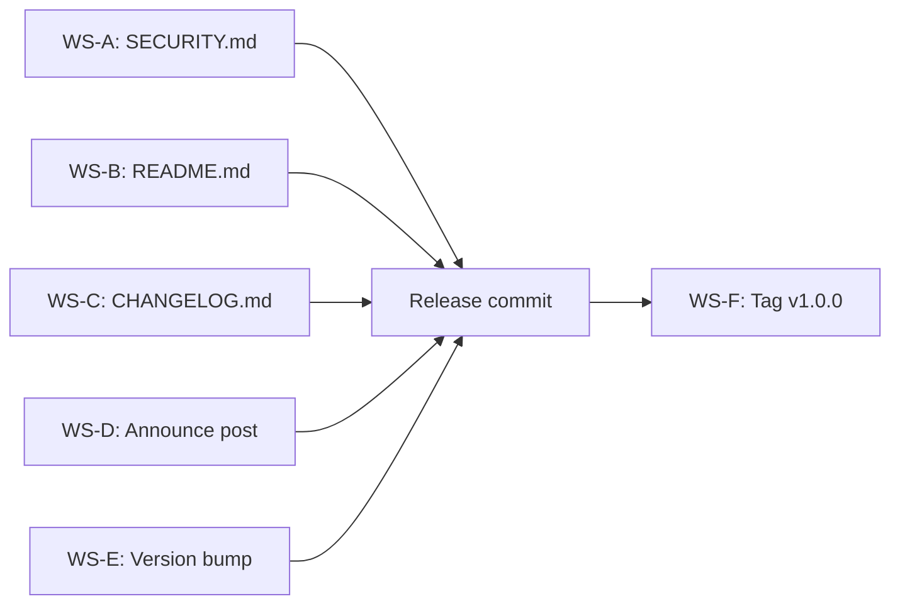

# Milestone 1.0.0 -- Production (2027-05-01 -> 2027-06-07)

| Field       | Value                                                                                     |
|-------------|-------------------------------------------------------------------------------------------|
| Version     | `1.0.0`                                                                                   |
| Codename    | Production                                                                                |
| Window      | 2027-05-01 -> 2027-06-07 (5 weeks)                                                       |
| Owner       | SupaZip contributors                                                                      |
| Status      | `complete`                                                                                |
| Parent      | `ROADMAP.md` -> 1.0.0 release criteria                                                    |
| Predecessor | `1.0-rc.1 -- Distribution` (tag `v1.0-rc.1`)                                             |
| Successor   | `1.1.0` (light theme, self-update, RAR, async)                                            |

## Goals

1. **SECURITY.md published.** A clear disclosure policy, contact email, scope definition, and supported-versions table. The document covers all crates in the workspace, packaging scripts, and CI workflows.
2. **README.md updated to production-ready.** Remove all "skeleton" and "working" language. Replace with production-ready status, feature list, and installation instructions for 7 distribution channels (Homebrew, AUR, winget, scoop, Nix, Docker, crates.io).
3. **CHANGELOG.md finalized.** A `1.0.0` entry above the existing releases documenting the security policy, production-ready status, and zero P0/P1 bugs in the RC period.
4. **Announce post template.** `docs/announce-1.0.md` with sections: What is it, Features, Architecture, Performance, Security, Installation, What's next.
5. **Version bump to 1.0.0.** All three crates (`supazip-core`, `supazip-cli`, `supazip-gui`) and their inter-dependencies updated from `0.5.0` to `1.0.0`.
6. **Tag `v1.0.0`.** Annotated tag with the full release message.

## Non-goals

- No new features, formats, or backends. The archive engine is frozen at the 0.5.0 surface.
- No `git push`. Tag is created locally only.
- No `cargo build` (local toolchain is rustc 1.88, project requires 1.92).
- No deletion of previous tags.

## Workstreams

### WS-A -- SECURITY.md

**Effort:** S

Create `SECURITY.md` at the repository root (~80-120 lines) covering:

- Supported versions (1.0.0+).
- Reporting a vulnerability: email (`security@example.com` placeholder).
- Disclosure policy: 90-day coordinated disclosure window.
- Scope: all crates, packaging scripts, CI workflows.
- Out of scope: third-party dependencies, social engineering.
- Security-related design decisions: resource limits, path-traversal, atomic writes, cancellation.
- Acknowledgments placeholder.

### WS-B -- README.md update

**Effort:** M

Update `README.md` to reflect production-ready status:

- Remove "Status: the engine, CLI, automated tests, and CI entry point are working. The GUI is a working skeleton" language.
- Replace with production-ready status covering all 5 backends, full CLI, GUI, 3 locales, WCAG 2.1 AA, 5 package managers + Docker.
- Update "Project status" table: all rows marked "Done".
- Add "Installation" section with instructions for brew, AUR, winget, scoop, Nix, Docker, crates.io.
- Update badges.

### WS-C -- CHANGELOG.md finalize

**Effort:** S

Add a `1.0.0` entry at the top of `CHANGELOG.md` (above `0.5.0`) with:

- Security: SECURITY.md disclosure policy.
- Changed: README production-ready, zero P0/P1 bugs in RC period.

### WS-D -- Announce post template

**Effort:** M

Create `docs/announce-1.0.md` (~200-300 lines):

- Title: "SupaZip 1.0: A cross-platform archive manager in Rust".
- Sections: What is it, Features, Architecture, Performance, Security, Installation, What's next (1.1 plans).
- Tone: technical but accessible, no marketing fluff.
- Placeholders for benchmark numbers and contributor list.

### WS-E -- Version bump to 1.0.0

**Effort:** S

Bump all crate versions and inter-dependencies:

- `supazip-core/Cargo.toml`: `version = "1.0.0"`
- `supazip-gui/Cargo.toml`: `version = "1.0.0"`
- `supazip-cli/Cargo.toml`: `version = "1.0.0"`, `supazip-core` dependency version `"1.0.0"`

### WS-F -- Tag v1.0.0

**Effort:** S

Create annotated tag `v1.0.0` with release message covering highlights:

- 5 archive backends (ZIP, 7z, TAR, TAR.GZ, TAR.XZ)
- CLI with completions (5 shells), JSON/YAML output, Ctrl-C cancellation
- GUI with drag-and-drop, context menus, progress dialog, settings
- 3 locales (en, ru, de) with CLDR plural rules
- WCAG 2.1 AA audited
- Packaging: Homebrew, AUR, winget, scoop, Nix, Docker, .deb, .rpm
- 5 release targets
- Signed releases (minisign) + CycloneDX SBOM
- 95%+ test coverage, property-based tests, criterion benchmarks, cargo-fuzz

## Dependency graph

All workstreams (A-E) converge into a single release commit, then the tag is created.

## Release checklist

- [x] Plan created (`docs/milestones/m1.0.0-production.md`).
- [ ] SECURITY.md with disclosure policy, contact, scope.
- [ ] README.md updated: production-ready status, installation section.
- [ ] CHANGELOG.md: 1.0.0 entry added.
- [ ] docs/announce-1.0.md: announcement template.
- [ ] Version bump: all crates to 1.0.0.
- [ ] Tag `v1.0.0` created (annotated).
- [ ] `cargo fmt --all -- --check` passes.
- [ ] `git status --short` clean (no unstaged changes).

## Risk register

| # | Risk | Likelihood | Impact | Mitigation |
|---|------|-----------|--------|------------|
| 1 | Version bump misses a Cargo.toml causing build failure | Low | High | Search for all `0.5.0` occurrences and verify after bump. |
| 2 | CHANGELOG format inconsistent with existing entries | Low | Low | Follow the exact format of the 0.5.0 entry. |
| 3 | Tag created on dirty working tree | Low | Medium | Run `git status` before tagging; ensure clean tree. |
| 4 | README installation instructions reference non-existent assets | Medium | Low | Use placeholder URLs; verify after distribution artifacts are published. |
