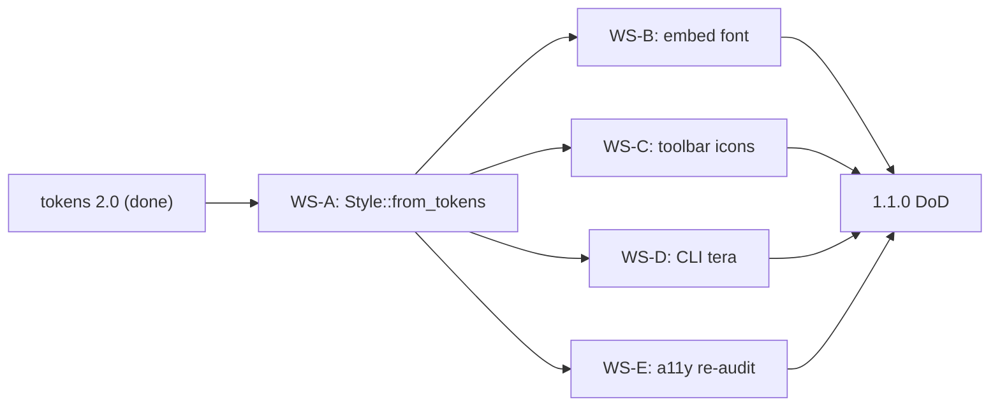

# Milestone 1.1.0 -- Design system v2 (after 1.0.1)

| Field       | Value                                                                 |
|-------------|-----------------------------------------------------------------------|
| Version     | `1.1.0`                                                               |
| Codename    | Design system v2                                                      |
| Window      | After `1.0.1` harden (no calendar dates)                              |
| Owner       | SupaZip contributors                                                  |
| Status      | `planned` (tokens 2.0 already landed; GUI/CLI runtime pending)        |
| Parent      | [`DESIGN.md`](../../DESIGN.md) (v2 contract)                          |
| Predecessor | `1.0.1` harden (CI, packaging identity, completions/man, CHANGELOG)   |
| Successor   | `1.2.0` product features (search, preview, editor, RAR helper)        |

Tokens 2.0 (`themes.dark` / `themes.light`, `meta.version` `2.0.0`) are
committed. This milestone is the **runtime**: GUI and CLI consume those
tokens. Do not start 1.2 product work, crates.io publish, or an aesthetic
reset until 1.0.1 is out and this milestone's DoD is green.

## Goals

1. **Tokens are runtime, not documentation.** `Style::from_tokens(theme)`
   maps `design/tokens.yaml` into `egui::Visuals` / `egui::Style`. Settings
   expose `theme: Dark | Light | System`.
2. **Two themes.** Dark keeps the 1.0 palette. Light uses `bg.base`
   `#F6F8FA` and meets WCAG 2.1 AA at the token level (already in YAML).
3. **Embedded JetBrains Mono** (OFL Regular + Bold) via `egui` `set_fonts`.
   Path and license: [`assets/fonts/README.md`](../../assets/fonts/README.md).
4. **Monoline toolbar icons** (SVG strokes, not PNG, not emoji) beside
   existing text labels.
5. **CLI `list` driven by** [`design/cli-table.tera`](../../design/cli-table.tera).
   Optional semantic colour on stderr only when it is a TTY.
6. **GUI a11y re-audit** of both themes after `Style::from_tokens` lands.
   Token-level light AA is not a substitute (see [`docs/a11y-audit.md`](../a11y-audit.md)).

## Non-goals

- **No 1.0.1 work in this milestone.** Harden CI, packaging placeholders,
  completions/man, and CHANGELOG dates first. Publish 1.0.1 before
  feature-creep or crates.io.
- **No archive editor.** In-place add / delete / rename stays 1.2.
- **No Material / Tailwind / Aqua / Fluent.** Same precise / dense / calm
  terminal; richer hierarchy, not a redesign.
- **No RAR, async backends, or CLI self-update.** Those are 1.2 (or later).
- **No high-contrast third palette.** Dark + light only.
- **No egui in `supazip-core`.** Mapper lives in `supazip-gui` or a thin
  theme crate without egui.

## Workstreams

### WS-A -- Theme runtime (`Style::from_tokens`)

**Effort:** M

Load tokens (include + serde, or codegen next to `check_tokens.py`). Map
the active `themes.*` colour tree plus shared spacing / radius / motion
into egui style. Wire `settings.theme`. Do not pull egui into core.

### WS-B -- Embedded font

**Effort:** S

Bundle JetBrains Mono Regular + Bold (OFL). Register in
`eframe::CreationContext`. Keep the documented fallback chain.

### WS-C -- Monoline toolbar icons

**Effort:** S

Five 14 px / 1.5 px-stroke glyphs next to `Open…`, `Extract`, `Create…`,
`Test`, `Cancel`. No PNG skins, no emoji, no icons in the entry grid or CLI.

### WS-D -- CLI table from tera

**Effort:** S

`cmd_list` renders through `cli-table.tera`. Colour only on a TTY stderr;
piped output stays plain.

### WS-E -- Light-theme GUI a11y re-audit

**Effort:** S

After WS-A, walk both themes against WCAG 2.1 AA (contrast, focus, keyboard).
Update [`docs/a11y-audit.md`](../a11y-audit.md). Do not claim a 17-row pass
from tokens alone.

## Definition of done

- [ ] `Style::from_tokens` is the only source of GUI colours / spacing
      (no stray hex literals that disagree with YAML).
- [ ] Settings can switch Dark / Light / System and the window restyles.
- [ ] JetBrains Mono is embedded; Cyrillic toolbar + grid render without tofu.
- [ ] Toolbar shows monoline icons beside labels.
- [ ] `supazip list` output matches `cli-table.tera`; no ANSI on pipes.
- [ ] `docs/a11y-audit.md` records a GUI re-audit for **both** themes.
- [ ] [`DESIGN.md`](../../DESIGN.md) still matches shipped behaviour
      (one canon; no `DESIGN-v2.md`).

## Dependency graph

WS-A is the gate. Font, icons, CLI, and the GUI a11y pass can proceed in
parallel after the mapper exists.
